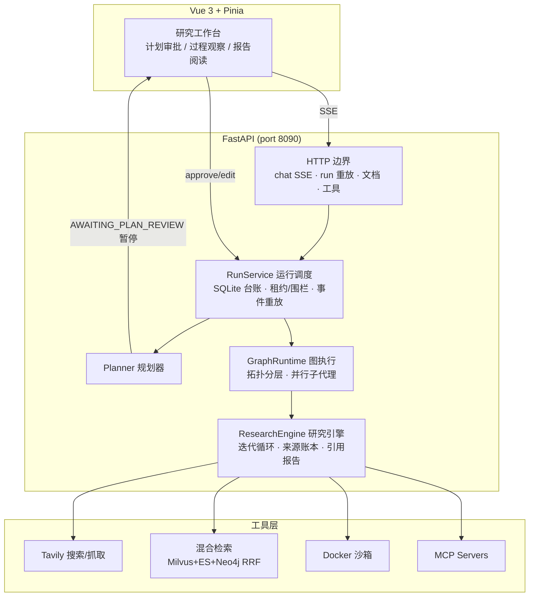

# AGI-Saber Research

**生产级深度研究（Deep Research）框架**：AI 先产出结构化研究计划，人工审批修订后执行——多轮检索、来源去重登记、沙箱代码分析，最终生成**每个结论都带编号引用**的研究报告。全流程持久化：断线重连、崩溃恢复、已验证步骤不重跑。

> 工作流形态（计划 → 人类审核 → 迭代研究 → 引用报告）对标 [ByteDance DeerFlow](https://github.com/bytedance/deer-flow)，运行时为完全自研的原生实现，不是 DeerFlow 的发行版或衍生版。

---

## 核心特性

### 研究工作流

- **计划级人工审批**：`plan_created` 后运行暂停在 `AWAITING_PLAN_REVIEW`，支持按步骤编辑（目标/指引/依赖/验收条件，CAS 版本冲突检测）、批准、拒绝；断线重连后仍是待审批态
- **迭代研究循环**：搜索 → 阅读 → 缺口分析 → 再搜索，来源统一登记（URL + 语义指纹两级去重），轮数/token/来源数/时长全部有预算上限
- **沙箱 Coder**：数据分析代码只交给 Docker 隔离容器（`python:3.11-slim`，网络/只读根/内存/PID 受限）；无沙箱时优雅降级为"仅生成代码"并明示
- **引用可溯报告**：分节流式写作，结论插入 `[n]` 编号引用，逐字摘录校验；证据不足时如实返回 `partial` 并标注缺口，无来源则失败——不伪造证据

### 生产级运行时（与同类框架的差异化）

- **持久化运行台账**：每个 run / worker / 事件落 SQLite，worker 心跳 + 任务租约（TTL）+ 围栏令牌，杜绝双接管与僵尸写入
- **动作日志重放恢复**：崩溃后只重放确定成功的步骤，副作用不确定的动作禁止自动重放
- **SSE 断线重放**：`Last-Event-ID` 游标 + 事件表回放，浏览器断网/重启后从断点续看
- **全链路取消**：HTTP 层取消令牌贯穿引擎，断连即停、已产出部分不浪费
- **预算治理**：每回合 LLM 调用 / 工具调用 / token / 来源数量 / 总时长硬上限

### 检索与工具

- **三路混合检索**：Milvus 语义 + Elasticsearch BM25 + Neo4j 知识图谱，RRF 融合排序，逐路熔断降级；`lightweight` 离线档（Chroma + BM25）与 `local` 极简档（纯 SQLite）零外部依赖可跑
- **MCP 协议客户端**：Streamable HTTP 传输、自动发现注册，与内置工具统一执行契约
- **双层人工审批**：计划级（研究开始前）+ 工具级（危险命令实时拦截），审批记录持久化
- **声明式工具注册**：`tools.example.yaml` 声明内置工具开关与 MCP server，启动时装配

### 智能体基础能力

- **多模式对话**：`rag_agent`（计划+子代理）/ `rag`（轻量检索）/ `react`（工具链）自动路由，两级意图漏斗（关键词 + 可灰度的 LLM 复核）
- **三层记忆**：短期（滑动窗口）/ 长期（Embedding+TF 双层，去重/合并/衰减）/ 用户偏好（LLM+规则），Neo4j 图增强召回
- **沙箱执行**：Docker / Local / Mock 三种后端，资源限制与命令白名单

### 质量工程

- **678 项自动化测试**（含取消、断连、并发、恢复重放、沙箱生命周期）+ ruff 正确性门禁 + GitHub Actions CI
- **内置评测平台**：不可变数据集、确定性指标、Trace 全链路、Badcase 回归与版本对比
- **确定性离线示例**：`examples/research/offline_demo.py` 不配置任何模型即可验证两轮研究与引用报告

## 架构总览



一次研究任务的状态流转：`创建 run → 生成计划 → **暂停待审批** → 人工批准/编辑 → 分步执行（research / code / write）→ 引用校验 → 报告产物落盘 → 完成`。任何一步崩溃都可从台账恢复。

## 快速开始

```bash
# 方式一：一键本地启动（自动生成 JWT 密钥，SQLite 存储，无需任何外部数据库）
python final/scripts/run_research_local.py
# 打开 http://127.0.0.1:8090 注册账号 → 研究工作台输入目标

# 方式二：标准部署（venv + conf.yaml + 前端构建）
cd final
python -m venv .venv && source .venv/bin/activate
pip install -r requirements.txt
cp config/conf.example.yaml config/conf.yaml   # 填入 LLM 与 Tavily key
npm --prefix web ci && npm --prefix web run build
AGI_CONFIG=config/conf.yaml uvicorn internal.application.bootstrap:create_app --factory --port 8090

# 方式三：容器
docker compose -f final/docker-compose.research.yml up --build -d

# 不配模型，先跑离线示例验证全流程
python final/examples/research/offline_demo.py
```

联网搜索需要免费 [Tavily API key](https://app.tavily.com)；只研究本地上传文档时可不配置。完整步骤与命令行 API 示例见 **[研究快速开始](final/docs/research-quickstart.md)**。

## 典型使用流程

1. **发起**：研究工作台输入研究目标（或 `python final/scripts/demo_research.py '<问题>'`）
2. **审批**：AI 产出分步计划 → 编辑步骤/依赖/验收条件 → 批准执行
3. **观察**：实时看到研究轮次、来源摘录、代码执行；关掉页面后台继续跑，重连自动续看
4. **报告**：分节展示、引用 `[n]` 悬浮跳转来源原文、一键下载 Markdown

## 配置

| 文件 | 用途 |
|---|---|
| `final/config/conf.example.yaml` | 精简档：模型 / 检索 profile / 研究预算 / 工具声明，默认零外部依赖 |
| `final/config/config.yaml` | 进阶档：PostgreSQL / Milvus / ES / Neo4j / Kafka 全套增强 |
| `final/config/tools.example.yaml` | 声明式工具与 MCP server 注册 |

优先级：`AGI_CONFIG` 显式路径 > `config.local.yaml` > `conf.yaml` > `config.yaml`；环境变量覆盖 YAML。

## 文档

| 文档 | 内容 |
|---|---|
| [研究快速开始](final/docs/research-quickstart.md) | 从克隆到跑通一次研究的完整步骤 |
| [研究运行时架构](final/docs/research-architecture.md) | 计划审批状态机与研究引擎设计 |
| [改造验收记录](final/docs/research-acceptance-20260926.md) | 真实模型端到端验收与已知边界 |
| [原生 Agent 运行时重构](final/docs/原生Agent运行时重构.md) | 运行台账、租约围栏、恢复重放设计 |
| [系统架构与核心流程图](final/docs/系统架构与核心流程图.md) | 全模块流程图 |
| [RAG 可靠性与故障恢复运行手册](final/docs/RAG可靠性与故障恢复运行手册.md) | 检索链路降级与恢复 |
| [Agent 质量评测平台使用指南](final/docs/Agent质量评测平台使用指南.md) | 评测数据集、指标与门禁 |

## 项目结构

```
├── final/
│   ├── main.py                  # 启动入口（组合根 bootstrap.build_deps）
│   ├── config/                  # conf.example.yaml（精简）/ config.yaml（全套）
│   ├── internal/
│   │   ├── agent/               # turn_service 编排 / planner / run_scheduler / recovery
│   │   ├── research/            # 研究引擎：迭代循环 / 来源账本 / 引用报告 / 沙箱 coder
│   │   ├── handler/             # HTTP 边界：chat SSE / run 断线重放 / 文档 / 工具路由
│   │   ├── rag/                 # 三路混合检索与降级
│   │   ├── tools/               # 工具执行器 + MCP 客户端
│   │   ├── harness/             # 危险工具审批与安全护栏
│   │   ├── infra/               # 外部依赖生命周期，逐依赖熔断降级
│   │   └── evaluation/          # 内置评测平台
│   ├── web/                     # Vue 3 + Pinia（研究工作台 / PlanReview / ReportInline）
│   ├── examples/research/       # 确定性离线示例
│   ├── tests/                   # 678 项测试
│   └── scripts/                 # run_research_local / demo_research / smoke_research
└── LICENSE                      # MIT
```

## 边界与路线

- 单进程线程模型，面向单实例部署；多实例水平扩展（无状态会话运行时）在路线图上
- 未包含报告衍生的 PPT / 播客生成（DeerFlow 具备）；研究模式不承诺与 DeerFlow 功能全对齐
- 引用校验保证"编号 ↔ 来源逐字对应"，不保证每条推断都被来源充分支持，高风险结论仍需人工审核

## License

[MIT](LICENSE)
