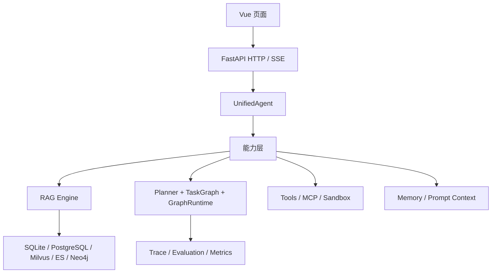
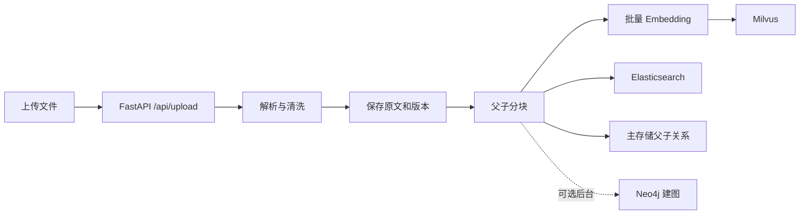
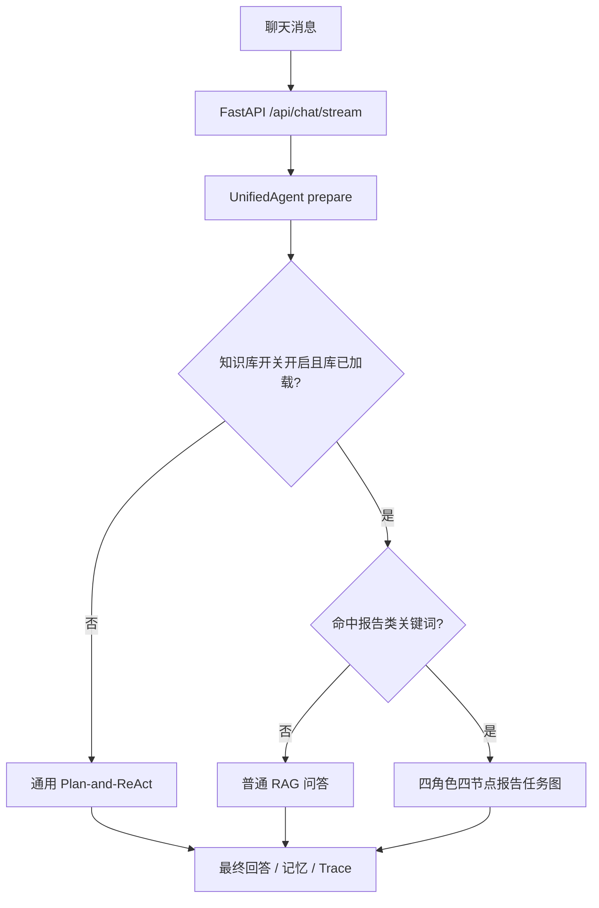
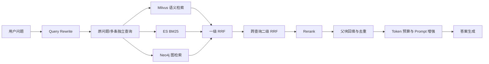

# AGI-saber Python 源码深度学习与面试手册

> **当前架构说明（2026-09-14）**：以 Go `845e8f7` 为冻结基线，对话主链为 `rag_agent / rag / react` 三路。报告类意图在开启 RAG 且知识库有内容时，执行 `research → writer → review → doc` 固定 DAG，最后保存 Markdown 并回填 RAG。Python 版已恢复该链路，本文相关段落描述的是当前行为。

> 目标：真正理解项目，而不是背技术名词。本文以当前 Python 源码为事实基线，Go 版只用于解释原始设计和对照差异。

## 0. 怎么使用这份手册

每一章按同一顺序组织：

1. 先用人话解释它解决什么问题；
2. 再说明当前 Python 版真实怎么做；
3. 给出关键源码入口；
4. 解释为什么这样设计、替代方案是什么；
5. 标出当前缺口；
6. 给出可以直接用于面试的表达。

全文使用三种事实标签：

- **已实现**：当前 Python 主链路有代码，可通过测试或运行验证；
- **部分实现**：已有接口或局部逻辑，但闭环、异常处理或指标仍不完整；
- **设计目标**：文档、简历或配置中存在，但当前主链不能当作已完成能力。

不要把“设计目标”说成“线上已经稳定运行”，也不要把单元测试通过说成检索效果提升。

---

## 1. 一句话理解项目

AGI-saber 不是单纯聊天机器人，而是一个面向个人知识管理和复杂任务执行的 Agent 实验平台：它能把私人文档构建成知识库，能调用工具完成多步骤任务，能维护用户记忆，也能记录 Trace、执行自动化评测并分析 Badcase。

它要解决的核心问题可以压缩成三个词：

- **找得准**：RAG 从私人文档中找到可靠证据；
- **能干活**：Planner、TaskGraph、GraphRuntime 和工具共同执行任务；
- **查得清**：Trace 与评测解释错在路由、检索、工具还是生成。

### 面试表达

> AGI-saber 是一个个人知识管理与复杂任务 Agent。它把文档入库、混合检索、工具调用、任务图执行、记忆和评测串成完整链路。我的理解重点不是“接了一个模型 API”，而是如何让模型获取受控证据、执行可追踪任务，并在失败时重试、降级和定位问题。

---

## 2. Python 版到底用了什么框架

### 2.1 结论

Python 版是**自研 Agent Runtime**，不是 LangChain 或 LangGraph 项目。

核心组合是：

```text
FastAPI + UnifiedAgent + Router + Planner
        + TaskGraph + GraphRuntime
        + 自研 RAG + Memory + Evaluation
```

前端使用 Vue 3、Pinia 和 Vite；后端使用 FastAPI、Pydantic，并按部署环境接入 SQLite/PostgreSQL、Milvus、Elasticsearch、Neo4j 等基础设施。

### 2.2 为什么不直接用 LangGraph

当前项目自己实现 TaskGraph 和 GraphRuntime，可以直接学习节点、依赖、拓扑层、并行、竞速、重试、取消和 Replan 的底层逻辑，代码也更轻。

代价是要自己承担：

- 状态持久化；
- 中断恢复；
- 条件分支和循环；
- 人工介入；
- 分布式调度；
- 可观测性与生态集成。

LangGraph 更成熟，适合复杂有状态工作流；当前自研 Runtime 更适合作为可控、可学习的轻量实现。若业务规模扩大，应评估 LangGraph、Temporal 或任务队列，而不是为了“自研”继续堆复杂度。

### 源码入口

- [UnifiedAgent](../internal/agent/agent.py#L108)
- [Planner](../internal/agent/planner.py#L113)
- [TaskGraph](../internal/graph/task_graph.py#L38)
- [GraphRuntime](../internal/agent/graph_runtime.py#L38)

---

## 3. 五层系统架构



### 3.1 页面层

负责上传文件、聊天、知识库开关、SSE 进度、文档库、评测页面和 RAG 实验台。

### 3.2 接口层

FastAPI 负责接收请求、Pydantic 校验、鉴权、请求大小与超时保护、SSE 输出、请求 ID 和错误转换。

### 3.3 Agent 编排层

UnifiedAgent 是总入口，负责准备上下文、选择模式、调用 RAG 或 Runtime，最后写回记忆。

### 3.4 能力层

包括 RAG、Planner、工具、子 Agent、Sandbox、Memory、Prompt Context 和 Evaluation。

### 3.5 存储层

不同存储保存不同数据，不是同一份内容盲目复制：

| 存储 | 主要职责 |
|---|---|
| SQLite | 本地开发与降级数据 |
| PostgreSQL | 文档、版本、RAG 子块、长期记忆等结构化事实主存储 |
| Milvus | 子块与长期记忆的稠密向量索引 |
| Elasticsearch | 子块 BM25 关键词索引 |
| Neo4j | 文档实体关系、可选图检索、图增强记忆 |
| Kafka/事件仓 | 事件发布和异步投影设计；当前不是每条核心链路的必要条件 |

---

## 4. 必须先区分的两条请求链

### 4.1 上传链：准备资料



上传入口已经明确知道“要解析并入库”，没有意图歧义，所以不经过 Agent Router，也不需要 Planner。

### 4.2 聊天链：决定如何回答或执行



### 4.3 当前路由真相

当前 Python 主路由并不是一个完整的 LLM Router。它的实际规则是：

1. `use_rag=true` 且知识库已加载；
2. 若命中报告工作流意图，进入 `rag_agent`；
3. 否则进入 `rag`；
4. 其余请求统一进入 `react`。

也就是说，虽然代码中保留 `chat`、`tool` 等 Schema 与辅助判断，当前主分发并没有稳定地把所有请求细分成 chat/tool/rag/react 四类。

### 源码入口

- [聊天与上传接口](../internal/handler/handler.py#L356)
- [UnifiedAgent 三段式 dispatch](../internal/agent/agent.py#L418)
- [当前 `_route_decide`](../internal/agent/agent.py#L488)
- [报告意图规则](../internal/agent/planner.py#L328)

### 当前缺口

报告关键词规则仍可能过宽，普通文档问答存在被误路由为报告工作流的风险。生产方案应使用更精确的意图分类、规则与模型双层判断，并用混淆矩阵验证。

---

## 5. FastAPI、SSE、异步与并发

### 5.1 为什么用 FastAPI

FastAPI 的价值不只是“性能快”，而是：

- async/await 适合 LLM、检索、工具这类 I/O 密集任务；
- Pydantic 提供请求和响应契约；
- OpenAPI 文档和依赖注入方便调试；
- StreamingResponse 适合 SSE；
- Python AI 生态更完整。

Flask 也能做，但异步与类型契约需要更多手工工作；Django 更适合完整业务后台，本项目会显得偏重。

### 5.2 为什么用 SSE

Agent 执行时间长，用户需要看到规划、检索、工具调用和生成进度。

| 方案 | 特点 | 是否适合本项目 |
|---|---|---|
| 普通 HTTP | 全部完成后一次返回 | 简单，但等待体验差 |
| 轮询 | 客户端反复查询状态 | 易实现，但浪费请求且延迟不稳定 |
| WebSocket | 全双工 | 能力强，但连接管理更复杂 |
| SSE | 服务端单向持续推送 | 正好适合 Agent 进度与 Token 流 |

当前事件包括 `start`、`route`、`memory`、`step`、`rag_result`、`token`、`done` 等。

### 5.3 同步 SDK 为什么会阻塞

如果在 FastAPI 的异步接口中直接调用耗时三秒的同步 Embedding SDK，它会占住事件循环线程，同进程其他协程无法及时调度。

常用解决方式：

1. 优先使用原生异步 SDK 并 `await`；
2. 没有异步 SDK 时使用线程池；
3. CPU 密集任务使用进程池；
4. 超长任务使用任务队列；
5. 用并发压测比较吞吐、P95 和错误率。

### 5.4 当前 SSE 的真实实现

Python 版用后台线程执行 Agent，把事件写入 `queue.Queue`，异步生成器再通过 `asyncio.to_thread(events.get)` 取出并推送。这样避免同步 Agent 逻辑直接阻塞 FastAPI 事件循环。

但仍需注意：

- 断线时能否立即取消底层网络请求；
- 心跳与代理超时；
- `Last-Event-ID` 断线续传尚未形成完整协议；
- 请求 ID 尚未贯穿所有内部 Trace；
- 上传接口虽然检查 `Content-Length`，仍会一次性 `read()` 整个文件，大文件应改为流式写临时文件。

### 源码入口

- [生产保护中间件](../internal/handler/handler.py#L270)
- [SSE 接口](../internal/handler/handler.py#L356)
- [取消接口](../internal/handler/handler.py#L467)
- [LLM 流式取消](../internal/llm/llm.py#L70)

### 面试表达

> SSE 适合 Agent 的单向进度与 Token 推送，比轮询实时、比 WebSocket 轻。Python 版通过线程执行同步 Agent，再用异步队列桥接给 StreamingResponse；生产上还需加强心跳、断线取消和事件续传。

---

## 6. RAG 入库：从文件到可检索证据

### 6.1 文档解析

上传 PDF、Markdown 或 TXT 后先解析文本、处理编码和空白。扫描 PDF 如果提取文本过少，会标记 `needs_ocr`，而不是把空内容写进索引。

原文和版本先进入文档库，再构建索引。保留原文和版本的意义是：更换分块、Embedding 模型或索引配置后，可以重建，而不依赖用户重新上传。

### 6.2 父子分块

关系是“一父多子”：一个父块包含多个子块，每个子块只属于一个父块。

```text
父块：第三章 项目预算与执行要求
├─ 子块 1：第一年度预算……
├─ 子块 2：第二年度预算……
└─ 子块 3：报销限制……
```

为什么不直接检索父块：父块通常包含多个主题，Embedding 会被稀释，精确术语也容易被噪声影响。

为什么不只返回子块：子块可能切断限定条件、标题和上下文，模型容易误解。

因此采用 Small-to-Big：小块负责找得准，父块负责语境完整。

### 6.3 递归切分与代码保护

Splitter 按标题、段落、换行、句号、逗号、空格逐级降级，最后才硬切字符；Markdown 三反引号代码块受到保护，避免把一个函数切成两个无意义片段。

### 6.4 Embedding 与多路写入

不是对整份文档生成一个向量，而是对子块批量生成 Embedding。

同一子块至少要保留统一的主存储标识，用于关联：

- Milvus：子块向量；
- Elasticsearch：子块文本 BM25；
- PostgreSQL/SQLite：子块正文、父块正文、文档与版本关系；
- Neo4j：可选实体和关系投影。

Embedding 批量调用失败时，当前实现允许对应批次跳过向量写入，继续保留关键词索引，属于局部降级。

### 源码入口

- [上传接口](../internal/handler/handler.py#L507)
- [递归分块](../internal/rag/splitter.py#L38)
- [RAG ingest](../internal/rag/rag.py#L84)
- [HybridStore 多路索引](../internal/rag/hybrid.py#L83)

---

## 7. RAG 查询完整链路



### 7.1 Query Rewrite

用户说“那它第二年的预算呢”，系统需要结合历史改写成“星槎四十七号项目第二年的预算是多少”。必要时生成多条互补查询，覆盖“预算、经费、资金安排”等不同表达。

优势：解决指代、省略、口语和文档措辞差异。

代价：多一次模型调用，增加延迟与成本；错误改写可能改变原意。更稳做法是保留原始查询，并只在多轮指代或表达含糊时启用改写。

### 7.2 三路检索

| 检索路 | 擅长 | 弱点 |
|---|---|---|
| Milvus 向量 | 同义表达、语义相似 | 编号、术语、否定词可能不稳 |
| Elasticsearch BM25 | 编号、专名、错误码、精确关键词 | 同义改写与语义泛化弱 |
| Neo4j 图谱 | 实体关系、多跳关联 | 建图成本高，普通事实问答未必有收益 |

图谱不是“关系复杂时凭感觉开启”，应由实体关系型意图或检索策略触发，并通过关系查询测试集证明收益。

### 7.3 一级与二级 RRF

一级 RRF 在一条查询内部融合向量、BM25、图谱；二级 RRF 再融合多条改写查询的结果。

公式：

```text
RRF(d) = Σ_i w_i / (k + rank_i(d))
```

当前平滑常数 `k=60`。与 Go `845e8f7` 一致，Milvus 语义路和 Elasticsearch 关键词路在 RRF 中都使用 `1.0` 权重，图谱路使用 `kg_weight`。`semantic_weight=0.7` 是为了配置结构兼容而保留的字段，当前不参与计分。

为什么不直接加原始分：向量相似度、BM25 和图谱分数不在同一量纲，归一化策略稍有变化就会影响排序；RRF 只依赖排名，更稳健。

RRF 的不足：丢失原始分数的强弱关系，所以还需要 Rerank。

### 7.4 Rerank

RRF 负责广撒网，Rerank 同时看“原始问题 + 候选子块”，重新判断谁真正能回答问题。

当前 Python 版的主精排是 LLM Listwise：一次给快速模型一批候选，让其返回候选编号和 0～10 分，再排序截断。配置可以关闭。远程模型显式失败时，发布配置默认使用本地 `LocalOverlapReranker` 做确定性的词项/字符重叠重排；若本地回退也失败，才沿用 RRF 顺序。配置也支持懒加载 `LocalCrossEncoderReranker`，缺少依赖、权重或推理失败时继续退到重叠排序。默认本地算法是可用性回退，不能宣称质量等价于远程精排。

当前还为远程 Rerank 接入了三态熔断器：连续失败达到阈值后进入 Open，冷却期内直接跳过远程调用并使用本地回退或 RRF；冷却结束进入 Half-Open，只放少量探测请求，探测成功恢复 Closed，失败则重新 Open。熔断状态和实际采用的是远程精排、本地回退还是 RRF，都会写入结构化 RAG Trace。

显式失败包括：

- 超时、断网、限流、服务错误；
- 上下文超限；
- 非法 JSON；
- 编号或分数缺失；
- 本地模型资源不足。

隐性失败是“格式正确但排序错了”，只能通过 Golden Query、MRR、NDCG 和 Badcase 发现。

Cross-Encoder 通常比通用 LLM 更稳定、成本低，适合固定语种和高吞吐；LLM Rerank 更灵活，适合复杂指令，但成本和格式稳定性更差。生产环境应做离线对比再选。

### 7.5 父块回填与 Prompt 增强

命中的是子块，最终根据主存储关系取回父块。同一父块多个子块命中时只放一次，再按相关性和 Token 预算截断。

增强 Prompt 至少包含：

- 用户问题；
- 证据父块；
- 来源标识；
- 只能依据证据回答；
- 证据不足必须说明；
- 文档内容是不可信数据，不能覆盖系统指令。

### 7.6 无答案阈值

无答案阈值是证据门槛。最高 Rerank 分数低于阈值时，应该拒答，而不是拿弱相关段落强行生成。

阈值太低会增加无依据回答；阈值太高会增加错误拒答。应构造可回答与不可回答验证集，遍历阈值并观察 Precision、Recall、F1 与两类错误成本。

更适合使用校准后的 Rerank 分数，而不是 RRF 分数；RRF 是排名融合值，不具备稳定概率含义。

**当前事实：Python 主链已接入默认 0.30 的无答案门禁，但只对成功的远程 Rerank 0~1 分数生效；本地 Cross-Encoder、重叠回退与 RRF 分数均未校准，因此不会被误用作拒答概率。仓库提供阈值遍历校准器和示例报告，但 0.30 仍只是默认配置；生产使用必须换成真实人工标注验证集重新校准。自动化回归结果必须引用同一提交的实际命令输出，不能沿用文档中的历史通过数。**

校准命令：

```powershell
python scripts/calibrate_no_answer_threshold.py examples/no_answer_labels.example.jsonl `
  --output docs/RAG无答案阈值校准报告.md `
  --json-output docs/RAG无答案阈值校准结果.json
```

输入字段是 `score`、人工标签 `answerable` 和可选的 `sample_id`。校准器明确把“应该拒答”定义为正类，遍历 0～1 阈值，输出 Precision、Recall、F1、错误拒答、无依据回答和加权业务成本。默认把无依据回答成本设为错误拒答的五倍，这只是演示口径，真实业务必须由风险负责人确定。

### 7.7 当前降级路径

HybridStore 会根据基础设施可用性选择：

- Milvus + ES：混合检索；
- 只有 Milvus：语义检索；
- 只有 ES：关键词检索；
- 都不可用但本地库可用：本地搜索；
- 全不可用：返回空结果。

当前本地回落并非完整的 SQLite FTS5 + 向量双路，而更接近本地行加载后的轻量词法相似；面试不能把它说成成熟的等价降级系统。

### 7.8 当前 RAG 真实缺口

- 无答案阈值已接主链，并已有可复现校准工具；仍缺真实业务标注集和模型/Prompt/知识库版本变化后的周期性再校准；
- 已有“远程 LLM → 可选 Cross-Encoder → 本地确定性重叠重排 → RRF”的有界回退；Cross-Encoder 采用懒加载且默认不开启，仍需安装模型并用真实检索集验证质量和延迟；
- 父块已做精确去重和可配置 0.85 的字符 3-gram/编辑相似度近重复去重；这是词法近似，不是语义向量相似度；
- 图谱权重已接入一级 RRF，但还缺少消融实验来证明默认权重合理；
- 已生成统一 `trace_id`，结构化记录改写查询、每路候选、二级 RRF、最终证据和拒答原因，并脱敏持久化到租户隔离的 Trace 仓库；仍需补分布式 span、保留期限、加密和审计策略；
- ES/Milvus 投影写入已有有界重试，Milvus 使用 upsert，并可从主存储执行 `/api/rag/reindex` 重建；SQLite 真相存储还会在 Chunk 保存、更新、删除的同一事务写投影 Outbox，依赖恢复后自动重放，避免残留幽灵索引。原生 PostgreSQL 路径仍缺同库 Outbox、持续对账和分布式并发验证；
- 本地降级质量与生产索引不等价。

### 源码入口

- [RAG 查询与回答组装](../internal/rag/rag.py#L171)
- [多查询与二级 RRF](../internal/rag/hybrid.py#L205)
- [三路 RRF](../internal/rag/hybrid.py#L262)
- [Query Rewriter](../internal/rag/rewriter.py#L18)
- [LLM Reranker](../internal/rag/reranker.py#L11)
- [本地确定性回退 Reranker](../internal/rag/local_reranker.py)
- [通用 Circuit Breaker](../internal/resilience/circuit_breaker.py)
- [无答案阈值校准器](../internal/evaluation/thresholds.py)
- [RAG 索引重建](../internal/rag/hybrid.py)

---

## 8. Router、Planner、ReAct、TaskGraph、GraphRuntime

### 8.1 五个角色不要混

| 组件 | 人话比喻 | 职责 |
|---|---|---|
| Router | 分诊台 | 选择走 RAG、通用任务还是报告工作流 |
| Planner | 计划员 | 把自然语言目标变成结构化节点 |
| TaskGraph | 任务板 | 保存节点、依赖、状态、结果和错误 |
| GraphRuntime | 调度员 | 按依赖并行执行，处理重试、取消和 Replan |
| Tool/SubAgent | 工人 | 真正查询、执行、写作或保存 |

Router、Planner、TaskGraph 和 GraphRuntime 都不是四个子 Agent。真正的报告子 Agent 是 Research、Writer、Review 和 Doc。

### 8.2 经典 ReAct 与当前方案

经典 ReAct 是：

```text
Thought → Action → Observation → 下一轮 Thought
```

它边做边想，适合探索性任务，但天然偏串行。

当前项目更准确叫 **Plan-and-ReAct**：先由 Planner 生成初始 DAG，能并行的先并行；执行中根据 Observation 判断是否需要 Replan。

一句话：ReAct 是边走边想；Plan-and-Execute 是先看全再走；本项目是先规划再执行，走不通时允许改路。

### 8.3 Planner 输出

Planner 输入：

- 用户问题；
- 当前上下文和记忆；
- 允许使用的工具；
- 是否允许报告子 Agent。

Planner 输出结构化节点，包含：

- 节点 ID；
- 类型；
- 工具或子 Agent 名称；
- 参数；
- `depends_on`；
- 可选竞速组。

模型输出 JSON 解析失败时，会回退到关键词规则规划。这里的“解析失败”是 Planner 输出不是合法 JSON，不是文档解析失败，也和 BM25 无关。

### 8.4 TaskGraph

TaskGraph 是有向无环图。节点保存任务，边表示依赖。它会：

- 检查依赖节点是否存在；
- 做拓扑分层；
- 发现环时报错；
- 判断哪些 Pending 节点已经 Ready；
- 保存 Done、Failed、Cancelled、Skipped 等状态。

普通列表只能表达固定先后；DAG 可以表达“天气与新闻并行，综合依赖二者”。

### 8.5 GraphRuntime

GraphRuntime 负责：

- 按拓扑层执行；
- 控制最大并发；
- 处理竞速组；
- 补充上游结果到下游参数；
- 单步超时和重试；
- 传播取消信号；
- 记录 Action、Observation 和工具 Trace；
- 触发 Replan 并追加节点。

### 8.6 Retry 与 Replan

Retry：原节点、原方法再做一次，适合网络抖动和临时超时。

Replan：承认原路线不足，修改或追加节点，例如搜索工具持续失败后改用另一个信息源。

当前默认配置没有开启 Replan；即使开启也有最大次数，避免任务图无限膨胀。

### 8.7 必需依赖与可选依赖缺口

当前 `ready_nodes()` 把 Done、Failed、Cancelled、Skipped 都视为前置已终止。因此新闻节点失败后，后续综合仍可能拿天气结果继续执行。

这适合“尽力回答”，但不适合强一致任务。更好的设计是区分：

- 必需依赖：失败就阻断下游；
- 可选依赖：允许下游降级继续，但必须披露缺失信息。

医疗、安全、支付、删除等高风险任务应默认采用必需依赖与硬门禁。

### 源码入口

- [路由规则辅助函数](../internal/agent/router.py#L36)
- [Planner 与规则回退](../internal/agent/planner.py#L113)
- [报告固定节点](../internal/agent/planner.py#L286)
- [TaskGraph](../internal/graph/task_graph.py#L38)
- [GraphRuntime](../internal/agent/graph_runtime.py#L38)
- [LLM Replan](../internal/agent/planner.py#L338)

### 面试表达

> 项目不是严格的逐步 ReAct，而是先用 Planner 生成 DAG，再由 Runtime 按拓扑层并行执行；Observation 不足或节点失败时可以受限 Replan。这样比纯串行 ReAct 更快、更可观测，但状态和异常处理更复杂。

---

## 9. Harness 的职责

### 9.1 概念边界

Harness 管“一次调用怎样安全可靠地执行”；GraphRuntime 管“整张图怎样调度”。

Harness 理想职责：

- 工具允许列表；
- 参数 Schema 校验；
- 单步超时；
- 有界重试与退避；
- 输出大小限制；
- 沙箱和权限；
- 状态、错误和 Trace 标准化；
- 幂等键与副作用保护。

GraphRuntime 职责：

- 依赖与并行；
- 图级状态；
- 竞速；
- 取消；
- Replan；
- 上下游结果传递。

### 9.2 当前 Python 实现真相

当前没有独立的 `Harness` 执行器类。`harness` 主要表现为配置项，单步超时与重试由 GraphRuntime 直接读取配置并执行。

因此准确说法是：

> 概念上 Harness 定义单步执行保护，当前实现把部分能力内嵌在 GraphRuntime；后续可抽成统一 InvocationHarness，减少 Tool、MCP、SubAgent 各自重复处理异常。

---

## 10. 工具调用、MCP 与 Sandbox

### 10.1 工具调用流程

1. 工具注册时声明名称、描述和参数；
2. Planner 只能从允许工具集合中选择；
3. Runtime 检查工具是否存在；
4. 用用户输入、偏好和上游结果补齐参数；
5. Harness 策略控制超时与重试；
6. 结果写成 Observation 和 ToolCallTrace；
7. 主 Agent 基于结果生成回答。

### 10.2 Tool、Skill、MCP 的区别

| 概念 | 作用 |
|---|---|
| Tool | 一个可调用函数或外部能力 |
| Skill | 一组指导模型如何完成某类任务的说明、脚本和资源 |
| MCP | 标准化连接外部工具与资源的协议 |

MCP 不自动保证安全。远程 MCP 工具仍要经过工具白名单、参数校验、超时、凭证隔离和 Trace。

### 10.3 MCP 的结构化失败与重试

MCP 调用优先返回结构化 `ToolResult`，其中包含 `success`、解析后的 payload、原始 JSON、`ToolError(code/message/retryable)`、耗时与元数据。GraphRuntime 据此决定是否重试，而不是看到异常就盲目重放：

- 参数错误、HTTP 4xx、主动取消不可重试；
- 网络错误、超时、HTTP 5xx 可在 Harness 上限内重试；
- 每次尝试把错误码、耗时和 retryable 写入事件/Trace；
- 取消后停止等待，不再发起下一次重试。

边界也要讲清：同步 Python SDK 已进入工作线程后不能被安全地硬杀，调度器只能停止等待并忽略迟到结果。带副作用的 MCP 工具仍需要服务端幂等键，结构化重试本身不能消除重复写风险。

### 10.4 Sandbox 为什么需要

模型生成的命令不能直接在主进程和真实工作目录执行。Sandbox 要限制：

- 文件系统范围；
- 网络；
- CPU、内存和进程数；
- 执行时间；
- 输出大小；
- 用户身份与权限。

当前 Validator 使用 safe/warn/block 静态规则，并提供本地与 Docker 后端。黑名单只能挡已知模式，不能代替 OS 级隔离；生产环境应优先白名单、最小权限和容器/微虚机隔离。

### 当前不足

- 静态正则可能误报和漏报；
- 本地 Sandbox 的隔离强度有限；
- 工具副作用和幂等还未统一建模；
- MCP 远程调用缺少完整租户级凭证治理。

### 源码入口

- [Tool 定义](../internal/tools/tools.py#L20)
- [MCP 工具注册](../internal/tools/tools.py#L348)
- [命令安全 Validator](../internal/sandbox/validator.py#L76)
- [DockerSandbox](../internal/sandbox/docker.py#L23)

---

## 11. 四个报告子 Agent


### 11.1 分工

- Research：规划 2～3 条查询，检索知识库或搜索，整理 Findings、Evidence、Open Questions；
- Writer：根据上游材料生成 Markdown 报告；
- Review：检查结构、事实一致性、证据覆盖和风险；
- Doc：调用真实文档写入方法保存，并选择重新入库 RAG。

### 11.2 为什么不让一个模型一次完成

拆分后中间输入输出更清楚，便于观察、局部重试、评测和定位失败；每一步 Prompt 也更专注。

代价是模型调用次数、延迟和费用增加，而且多个 Agent 可能仍使用同一个模型，不代表天然更聪明。

### 11.3 当前关键缺口

Go `845e8f7` 与当前 Python 都是四节点固定链：

```text
Research → Writer 初稿 → Review 问题清单 → Doc 保存 Writer 初稿
```

Review 结果会作为上游输出和文档元数据保留，但当前不会修改正文，也不会阻止 Doc 保存。代码里没有 Writer Revision 或 Final Gate。剩余缺口是：

- 增加有界修订并按质量增益或预算停止；
- 增加结构化保存门禁，并区分阻断问题与可人工确认问题；
- 总时间和费用预算；
- 用标注报告评测门禁漏报、误报和修订收益。

### 源码入口

- [内置子 Agent 注册](../internal/agent/subagents.py#L37)
- [ResearchAgent](../internal/agent/subagents.py#L49)
- [WriterAgent](../internal/agent/subagents.py#L115)
- [ReviewAgent](../internal/agent/subagents.py#L135)
- [DocAgent](../internal/agent/subagents.py#L155)

---

## 12. 记忆系统与上下文组装

### 12.1 正确口径：三类核心 + 两个扩展

不要说“项目正式定义了五层记忆”。更准确的说法是：

- 短期记忆：最近 N 轮对话滑动窗口；
- 长期记忆：跨会话可语义召回的事实与经历；
- 用户偏好：姓名、城市、语言、回答习惯等键值；
- Task Memory：本次任务内的 Observation，属于运行时上下文；
- Graph Memory：长期记忆的可选关系增强。

### 12.2 写入链路

用户输入先用规则快速抽取明确偏好，同时异步调用模型抽取复杂信息并写长期记忆；回答完成后，还会从回复中抽取值得长期保存的事实。

长期记忆条目带有：内容、Embedding、重要度、类别、标签、时间、状态、版本等。写入前有安全检查、第三方人物信息过滤和去重。本地 SQLite 在同一事务提交权威行与 Outbox，由本地 Worker 更新投影账本；生产 PostgreSQL 在同一事务提交 `long_term_memory` 与按 Milvus/Neo4j target 拆分的 Outbox，成功后才更新进程缓存。生产消费者按版本与内容哈希幂等应用，并提供 `SKIP LOCKED` 租约、过期回收、指数退避、dead-letter 和周期 reconcile；真实外部集群故障恢复仍需完整环境验证。

### 12.3 读取链路

不是把所有记忆塞进 Prompt，而是按模式 Schema 装配：

- Chat：约束、用户画像、相关长期记忆；
- Tool：增强工具状态；
- ReAct：加入 Planner、Task Memory、工具状态；
- RAG：弱化任务信息，保留画像、约束和相关事实。

所有槽位受全局预算和单槽位预算控制。安全约束优先级最高，普通 Recall 最低。

### 12.4 Consolidation

长期记忆会周期性：

- 去重；
- 合并相似记忆；
- 重要度衰减；
- 清理过期低价值记忆；
- 图增强模式下保护高中心度节点并同步删除/更新。

### 12.5 最大风险：记忆污染

当前会从助手回复抽取长期记忆。如果模型回答本身错误，可能把幻觉再次持久化。

生产改进应包括：

- 保存来源、置信度和提取模型版本；
- 用户明确陈述优先于模型推断；
- 高影响事实要求用户确认；
- 支持查看、修改、删除；
- 防 Prompt 注入写入；
- 租户级隔离与保留期限。

### 源码入口

- [ShortTerm / LongTerm](../internal/memory/memory.py#L83)
- [Preference](../internal/memory/preference.py#L16)
- [异步记忆写入](../internal/agent/memory_writer.py#L203)
- [Prompt Context Schema](../internal/promptctx/schema.py#L35)
- [Memory System Prefix](../internal/agent/agent.py#L668)

---

## 13. Neo4j 知识图谱

### 13.1 两种用途

项目中的 Neo4j 有两类用途，不要混淆：

1. 文档知识图谱：从子块抽实体和关系，查询时补关系证据；
2. 图增强记忆：长期记忆节点之间建立 FOLLOWS、SIMILAR_TO 等关系，召回后扩展邻居。

它们也不要和 TaskGraph 混淆：TaskGraph 是一次请求的任务依赖图；Neo4j 是持久化知识或记忆关系图。

### 13.2 什么时候值得用

适合：人物—机构—项目、多跳关系、时间链、药品—禁忌—人群等关系型问题。

不适合：简单事实、短文档和纯文本定位。图构建会增加抽取成本、错误传播和一致性维护。

### 13.3 如何证明有用

单独构造关系型查询集，对比：

```text
向量 + BM25
vs
向量 + BM25 + 图谱
```

观察 Recall@K、MRR、NDCG、多跳问题正确率、延迟和成本。不能用“关系复杂时就上图谱”作为唯一论证。

### 当前不足

图谱权重已经接入一级 RRF；建图失败虽不阻塞入库，但仍缺少完善的重放、补偿、权重消融和质量报告。

---

## 14. 超时、重试、熔断、取消、回退与幂等

| 机制 | 解决的问题 | 典型做法 |
|---|---|---|
| Timeout | 请求永远不返回 | 设置单步和请求总时限 |
| Retry | 短暂抖动 | 有界次数、退避、只重试可恢复错误 |
| Circuit Breaker | 服务持续故障 | Closed/Open/Half-Open，冷却后探测 |
| Cancel | 用户不再需要结果 | 令牌向下传播并终止网络/工具调用 |
| Fallback | 主能力不可用 | 换较弱但可用的路径，并明确降级 |
| Idempotency | 重试造成重复副作用 | 幂等键、唯一约束、状态机 |

### 14.1 熔断器三态

- Closed：正常调用并统计失败；
- Open：达到失败阈值后，在冷却期直接拒绝或降级；
- Half-Open：冷却后只放少量探测请求，成功则恢复，失败重新打开。

Retry 处理单次短暂故障，Circuit Breaker 处理跨请求持续故障，防止雪崩。

### 14.2 当前真实状态

- 单步超时与重试：已实现；
- 请求级超时：已实现；
- 取消令牌：已实现，但底层调用是否能立即停止取决于 SDK；
- RAG 路线降级：部分实现；
- Rerank、Embedding、Milvus、Elasticsearch 和知识图谱检索：均已接入可复用三态熔断器；各依赖独立统计，避免一处故障拖垮全部路径；
- RAG Chunk 投影：Milvus 已使用 upsert，ES/Milvus 写入有界重试，可从主存储重建；SQLite 路径已用事务 Outbox、指数退避和 dead/retry 状态补偿；
- 长期记忆投影：SQLite/PostgreSQL 权威行均采用 outbox-first；SQLite Worker 只更新本地投影账本，生产 PostgreSQL 消费者才以租约、重试、dead-letter 和周期 reconcile 驱动 Milvus/Neo4j。当前自动化合同不等于真实外部集群故障注入已经完成；
- 文档写入等其他外部副作用的统一幂等：仍未完整实现；
- SSE 断线自动取消和断点续传：仍需加强。

### 面试表达

> 重试是不改方案再做一次，Replan 是改任务图，熔断是持续故障时跨请求保护系统，降级是主能力不可用时用较弱路径继续服务，幂等则防止重试重复写数据。这些机制解决的问题不同，不能混成一句“失败就重试”。

---

## 15. Trace、日志、指标与 Badcase

### 15.1 Trace 不是聊天记录，也不是思维链

Observation 是某一步得到了什么；Trace 是整次请求实际发生了什么。

不应存储模型的隐藏推理，而应记录可观察事实：

- 请求、会话、模型和配置版本；
- 路由模式；
- Query Rewrite；
- 各路候选 ID、排名、分数；
- RRF、Rerank 和父块选择；
- Planner 节点与依赖；
- 工具名、脱敏参数、耗时、结果摘要；
- Retry、Fallback、Cancel、Replan；
- 最终证据、答案、安全规则和评测标签。

### 15.2 Badcase 定位原则

沿信息流寻找关键信息第一次丢失的位置。

例如用户说明青霉素过敏，却推荐阿莫西林：

```text
原始输入
→ 意图/实体抽取
→ 短期记忆和上下文组装
→ RAG 禁忌证据
→ 工具参数
→ 最终模型输入
→ 模型输出
→ 安全拦截
```

第一次缺少“青霉素过敏”的位置，就是主要责任层。不能一上来把所有错误归因于检索。

### 15.3 指标

最少要观察：

- 成功率和错误率；
- P50/P95/P99 延迟；
- 各模式占比；
- 工具成功率、重试率、超时率；
- RAG 各路命中与降级率；
- 无答案率和错误拒答率；
- Token 与调用成本；
- S0/S1 高风险 Badcase 数。

当前项目会为每次回答生成 `trace_id`，记录节点事件、Action、Observation、工具调用、RAG 候选排名、Rerank 路径、证据预览与拒答原因；落库前会递归脱敏密钥、Bearer Token、手机号、邮箱和身份证样式内容，并按用户隔离读取。API 提供 `GET /api/traces` 和 `GET /api/traces/{trace_id}`。仍未完成的是跨服务 span、Prompt 与引用的完整映射、字段级加密、保留期限和访问审计。

---

## 16. 自动化评测

### 16.1 评测集怎么构造

每条 RAG Golden Query 至少包含：

- query；
- gold chunk/evidence IDs；
- 可选多级相关性；
- 可回答/不可回答标签；
- 场景与风险标签；
- 数据来源与版本。

Agent 用例还要包含：意图、必填槽位、期望工具、参数约束、必要内容、禁止内容、是否必须 fallback、期望 Trace 事件。

### 16.2 检索指标

**Hit@K**：前 K 是否至少命中一个正确块。

**Recall@K**：前 K 命中的正确块数 / 全部正确块数。

**MRR@K**：第一个正确块排名的倒数，再对所有查询平均。

**NDCG@K**：考虑多级相关性和排序位置，强相关证据排得越前越好。

重排只调整候选顺序、不新增候选，因此 NDCG/MRR 上升而 Recall 基本不变是合理现象。

### 16.3 Precision、Recall、F1

先定义正类。例如把“应该拒答的无答案问题”当作正类：

```text
Precision = 正确拒答 / 所有系统拒答
Recall    = 正确拒答 / 所有应该拒答
F1        = 2PR / (P + R)
```

医疗安全通常优先 Recall，避免漏掉高风险，但要控制误报和告警疲劳。

### 16.4 无答案阈值怎样真正校准

1. 人工构造同时包含可回答和不可回答问题的验证集；
2. 固定知识库、Rerank 模型与 Prompt，记录每题最高 Rerank 分数；
3. 遍历阈值，将“分数低于阈值”视为系统拒答；
4. 统计正确拒答、错误拒答、无依据回答和正确回答；
5. 根据业务成本选择阈值，而不是只取 F1 最大值；
6. 在模型、Prompt、分块或知识库版本变化后重新校准。

仓库实现：[thresholds.py](../internal/evaluation/thresholds.py)；可运行入口：[calibrate_no_answer_threshold.py](../scripts/calibrate_no_answer_threshold.py)。示例数据只证明工具链可运行，不证明生产阈值就是 0.28 或 0.30。

### 16.5 消融实验

建议逐步比较：

```text
BM25
纯向量
向量 + BM25
+ Query Rewrite
+ Rerank
+ 图谱
```

每次只增加一个变量，观察 Recall、MRR、NDCG、无答案识别、P95 和成本，才能说明哪个组件带来收益。

### 16.6 LLM Judge 如何使用

确定性问题优先用代码判断：工具名、参数、证据 ID、禁词、JSON Schema、延迟。

主观质量再用 LLM Judge，并配合：

- 清晰评分 Rubric；
- 顺序随机；
- 重复评测；
- 多模型交叉；
- 人工黄金集校准一致率；
- 高风险和不一致样本人工复核。

### 16.7 医疗高风险上线门禁

不能只看加权平均。普通用例大量通过会掩盖少量致命失败。

建议：

- S0 致命风险零容忍，一条失败就禁止上线；
- S1 高风险达到独立门槛；
- 普通体验指标达标后才进入灰度；
- 修复 Badcase 后必须回归该类和全量集。

### 16.8 当前评测平台真实不足

- Local/HTTP Adapter 已改为从 `metadata.input.use_rag` 读取输入开关，不再读取 `expected.evidence_ids`；旧数据集需要补齐输入元数据；
- 多轮回放主要执行 user turn，没有完整复现 assistant/tool 历史；
- `intent` 当前取运行模式，不完全等于业务意图；
- slots 仍是空字典，信息收集评测未完整接真实链路；
- 当前评测器以确定性规则为主，缺少经过校准的语义 Judge；
- Replay 是合成回放，不能当作真实模型线上跑分。

### 源码入口

- [评测 Schema](../internal/evaluation/schemas.py#L1)
- [Adapter](../internal/evaluation/adapters.py#L1)
- [确定性 Evaluators](../internal/evaluation/evaluators.py#L30)
- [EvaluationService](../internal/evaluation/service.py#L36)

---

## 17. 安全、隐私与权限隔离

### 17.1 主要威胁

- Prompt 注入：文档或网页诱导模型忽略系统规则；
- 工具越权：模型调用未授权工具或高风险参数；
- 数据越权：用户读取其他租户文档和记忆；
- 敏感信息泄漏：Trace、日志或错误返回包含病历、密钥；
- 记忆投毒：恶意内容被长期保存；
- 代码执行：命令逃逸、网络外联、资源耗尽；
- 间接副作用：重试导致重复写文档、发送消息或付款。

### 17.2 防护原则

- 系统指令、用户输入、检索证据使用明确边界；
- 文档内容永远是数据，不拥有工具授权；
- 每种模式拥有独立工具白名单；
- 工具参数 Schema 校验；
- 高风险操作二次确认；
- 沙箱最小权限、默认断网、限定工作目录；
- user_id 贯穿文档、记忆、评测和 Agent Registry；
- Trace 脱敏、加密、权限审计和保留期限；
- 密钥只放环境变量，不进源码、日志、文档和前端。

### 17.3 医疗场景特别要求

- 识别潜在急症并优先就医建议；
- 信息不足时不能直接确诊或推荐处方药；
- 过敏、用药史、孕期和基础病是关键槽位；
- 工具失败不能声称办理或查询成功；
- 高风险建议要硬门禁与人工复核；
- 不收集完成任务不需要的隐私。

---

## 18. Python 与 Go 的对应关系

| 能力 | Python | Go | 结论 |
|---|---|---|---|
| HTTP/SSE | `internal/handler/handler.py` | `interfaces/http/handler` | 主要接口已对齐，取消传播细节不同 |
| UnifiedAgent | `agent/agent.py` | `application/chat/core_agent.go` | 主编排思想一致 |
| Planner | `agent/planner.py` | `application/chat/plan_graph.go` | Python 复刻了图规划与规则回退 |
| GraphRuntime | `agent/graph_runtime.py` | `application/chat/runtime_graph.go` | 主要调度能力一致，工程成熟度仍有差距 |
| RAG | `rag/*` | `domain/rag/*` | 父子分块、多查询、RRF、Rerank 基本对应 |
| 子 Agent | `agent/subagents.py` | `application/chat/subagents.go` | 四角色与四节点依赖对应；两边的 Review 都不自动改写正文或阻止保存 |
| Prompt Context | `promptctx/*` | `domain/promptctx/*` | Schema/Slot 思想对应 |
| Memory | `memory/*`、`repo/longterm.py`、`repo/memory_projection.py` | `domain/memory/*` + application | 权威 DB + 事务 Outbox、版本/哈希幂等对应；生产 PG 有租约重试与对账，SQLite 为本地账本；真实集群仍需验收 |
| Sandbox | `sandbox/*` | `domain/infrastructure sandbox` | 策略对应，部署隔离依赖环境 |
| Evaluation | Python 新增平台 | Go 无完全相同主模块 | Python 的扩展，不是简单复刻 |
| RAG Lab | Python 新增 | 无相同页面 | 用于教学演示，不污染正式知识库 |

### 18.1 不要说“Python 完全等价 Go”

更准确的表达：

> Python 版复用了 Go 版的领域划分和核心契约，并对 Router、Planner、TaskGraph、RAG、Memory、Sandbox 做了对应实现；但语言并发模型、取消传播、存储一致性和部分工程能力不是逐行等价，需要通过契约测试和故障注入核验。

### 18.2 Go 版也不是“绝对正确答案”

Go 版同样可能存在设计未闭环。对标应比较接口、状态机、异常语义和测试证据，而不是看到 Go 中有某文件就认为功能已经生产化。

---

## 19. 当前最值得补的改进方案

### P0：正确性与可信度

1. 已接入无答案门禁和校准 CLI；下一步换成真实业务人工标注集，确定阈值并建立版本变更后的再校准门禁；
2. 已修复评测 Adapter 的 RAG 标签泄漏；下一步补完整多轮回放；
3. 已为 TaskGraph 增加必需/可选依赖语义；下一步把跳过原因结构化进 Trace；
4. 报告流程目前是 Research → Writer → Review → Doc；下一步补有界修订和结构化保存门禁，再用标注报告评测漏报和误报；
5. 已为请求生成统一 `trace_id`，结构化记录 RAG 各路候选、Rerank、父块证据和拒答原因，并完成脱敏持久化与租户隔离；下一步扩展为跨服务 span、字段级加密、保留期限和访问审计；
6. 当前为对齐 Go 的宽关键词报告路由；下一步用独立分类与保存确认降低误写入，但要作为明确的版本语义变更发布。

### P1：稳定性

1. 抽离统一 InvocationHarness；
2. 熔断器已抽成通用模块并覆盖 Rerank、Embedding、Milvus、Elasticsearch 和图谱检索；远程 Rerank 已有本地确定性回退，下一步是用 Cross-Encoder 做质量/延迟对照实验，而不是把现有回退冒充神经精排；
3. 加强 SSE 断线取消、心跳与续传；
4. 为文档写入和外部副作用增加幂等键；
5. RAG Chunk 多库写入已提供 upsert、有界重试和从主存储重建；长期记忆的 SQLite/PostgreSQL 路径均有事务 Outbox，本地路径更新本地账本，生产 PostgreSQL 投影具备租约、重试、dead-letter 与周期对账。下一步在真实 Milvus/Neo4j 集群做断线、乱序、重复投递和并发消费者故障注入，并接入告警。

### P2：性能

1. 查询改写按需触发；
2. Embedding 批量与缓存；
3. Cross-Encoder 替代高成本 LLM Rerank 的对照实验；
4. 线程池容量、连接池和 P95 压测；
5. 上传流式处理。

### P3：产品与可演示性

1. RAG 实验台展示父子块、查询向量、召回、Prompt 和答案；
2. Trace 页面展示节点时序与失败点；
3. 评测页面展示基线与候选版本对比；
4. 记忆管理页面支持查看、修改、删除与来源解释。

---

## 20. RAG 实验台怎么演示

项目已提供隔离的 RAG 教学流水线，不写入正式知识库。

推荐演示顺序：

1. 粘贴一段包含标题、编号和上下文的文档；
2. 展示父块和子块；
3. 输入一个同义表达问题；
4. 展示真实 Embedding 或明确标记的本地 Hash 向量回退；
5. 展示候选与相似度；
6. 展示最终增强 Prompt；
7. 生成答案；
8. 用一个库外问题解释为什么需要无答案阈值。

### 源码入口

- [RAG Lab 后端](../internal/rag/lab.py#L25)
- [RAG Lab API](../internal/handler/handler.py#L478)

---

## 21. 高频技术选型问答

### 21.1 为什么 BM25 和向量一起用

> 向量检索擅长语义，BM25 擅长编号、专名和错误码。两种信号互补，先提高候选召回，再用 RRF 融合和 Rerank 精排。是否有效要通过消融实验，而不是因为“这是主流方案”。

### 21.2 为什么 RRF 不直接加分

> 向量相似度和 BM25 分数的范围与分布不同，直接相加必须做稳定校准。RRF 只依赖排名，对不同检索系统更稳健；缺点是丢失分数强弱，所以后面需要 Rerank。

### 21.3 为什么有 RRF 还要 Rerank

> RRF 只用排名做快速粗排，保证候选覆盖；Rerank 联合看问题与候选内容，优化 MRR/NDCG。Rerank 不新增候选，因此通常不提高召回率。

### 21.4 为什么小块召回、父块返回

> 大块多主题会稀释语义，小块主题集中更容易命中；但小块缺上下文，所以命中后回填父块。在检索精度和语境完整之间平衡。

### 21.5 为什么 Router 不让所有问题都走 Planner

> 简单事实问题直接 RAG 更快、更便宜；所有请求都规划会增加模型调用、延迟和错误点。复杂任务才值得进入任务图。

### 21.6 为什么多 Agent 不一定更好

> 多 Agent 的核心价值是职责分离、中间结果和局部评测，而不是模型数量本身。它会增加成本和延迟，必须通过报告事实错误率、审查拦截率和人工偏好证明收益。

### 21.7 为什么 Trace 不能只存最终答案

> 最终答案只能说明错了，不能说明在哪错。结构化 Trace 可以定位信息第一次丢失的位置，并支持自动评测、耗时分析和回归验证。

---

## 22. 90 秒项目介绍模板

> AGI-saber 是一个面向个人知识管理和复杂任务执行的 Agent 系统。前端使用 Vue，后端使用 FastAPI 和 SSE。文件上传后经过解析、父子分块和批量 Embedding，子块分别进入 Milvus 向量索引和 Elasticsearch BM25，并保存父子与版本关系；查询时进行多查询改写、向量/BM25/可选图谱召回、两级 RRF、Rerank 和父块补全，再基于证据生成答案。
>
> 对通用任务，系统先由 Planner 生成结构化任务图，TaskGraph 保存必需/可选依赖，GraphRuntime 按拓扑层执行并处理并行、超时、重试、取消和受限 Replan。知识库模式下命中研究、总结、报告、文档、方案或分析关键词时，会使用 Research、Writer、Review、Doc 四节点固定链；Review 意见会被保留，但当前不会自动修改正文或阻止保存。系统还实现了短期、长期和偏好记忆、可选图增强、Trace 与自动化评测。
>
> 我认为这个项目最有价值的不是堆组件，而是把“检索、执行和评测”工程化。我先用可执行合同恢复了 Go `845e8f7` 的三路路由、Research→Writer→Review→Doc 四角色 DAG、Doc 文档保存与 RAG 回填、MCP 结构化失败和记忆 outbox-first 语义，再在 Python 扩展中补了阈值校准、通用三态熔断、可选 Cross-Encoder/本地 Rerank 回退、父块近重复去重、Trace 生命周期治理和可重建投影。Review 按冻结基线作为审查结果/元数据而不是改稿门禁；若未来增加 Revision，应作为新策略演进而非“复刻缺口”。自动化合同和 Replay 基准不能冒充真实业务质量，完整结论仍需真实标注集、外部集群故障注入、Cross-Encoder 对照和多轮线上评测。

---

## 23. 源码阅读顺序

### 第一轮：只看主链

1. [handler.py](../internal/handler/handler.py)
2. [agent.py](../internal/agent/agent.py)
3. [planner.py](../internal/agent/planner.py)
4. [task_graph.py](../internal/graph/task_graph.py)
5. [graph_runtime.py](../internal/agent/graph_runtime.py)

目标：能画出上传、RAG、ReAct、报告四条链。

### 第二轮：RAG

1. [rag.py](../internal/rag/rag.py)
2. [splitter.py](../internal/rag/splitter.py)
3. [hybrid.py](../internal/rag/hybrid.py)
4. [rewriter.py](../internal/rag/rewriter.py)
5. [reranker.py](../internal/rag/reranker.py)

目标：能解释每一步输入输出、失败回退和评测指标。

### 第三轮：Agent 工程化

1. [subagents.py](../internal/agent/subagents.py)
2. [cancel.py](../internal/agent/cancel.py)
3. [tools.py](../internal/tools/tools.py)
4. [sandbox](../internal/sandbox/)
5. [promptctx](../internal/promptctx/)
6. [memory](../internal/memory/)

目标：能解释权限、状态、上下文、记忆和副作用。

### 第四轮：评测

1. [schemas.py](../internal/evaluation/schemas.py)
2. [adapters.py](../internal/evaluation/adapters.py)
3. [evaluators.py](../internal/evaluation/evaluators.py)
4. [service.py](../internal/evaluation/service.py)
5. [thresholds.py](../internal/evaluation/thresholds.py)

目标：能设计评测集、算指标、定位 Badcase，并指出当前平台偏差。

---

## 24. 学完后的自测清单

不看文档，确认自己能回答：

- 上传为什么不经过 Router？
- 知识库开关开启后，普通问答和报告任务怎样分流？
- Python 版为什么不是 LangGraph？
- Planner、TaskGraph、GraphRuntime 和 Harness 分别做什么？
- Retry、Replan、Circuit Breaker 和 Fallback 有什么区别？
- 为什么小块召回而返回父块？
- 为什么同时使用向量、BM25 和图谱？
- 两级 RRF 分别融合什么？
- RRF 和 Rerank 分工是什么？
- 无答案阈值怎样校准？
- Rerank 显式失败和隐性失败如何处理？
- Trace 和 Observation 有什么区别？
- 如何沿 Trace 找到信息第一次丢失的位置？
- 三类核心记忆与两个扩展分别是什么？
- Review Agent 当前为什么没有真正改正文？
- SSE 为什么比轮询或 WebSocket 更适合当前场景？
- 同步 SDK 为什么会阻塞 FastAPI 事件循环？
- 工具、Skill、MCP 和 Sandbox 的边界是什么？
- 如何防 Prompt 注入、越权工具和记忆污染？
- Recall、Hit、MRR、NDCG、Precision、F1 怎么算？
- 为什么医疗高风险不能只看总体通过率？
- 当前 Python 版有哪些不能说成“已完整实现”的能力？

如果这些问题都能用“背景 → 方案 → 取舍 → 证据 → 不足”回答，才算真正理解项目。

---

## 25. 最终原则

面试中不要追求把项目说得完美，而要证明自己具备工程判断：

1. 能讲清楚一条请求真实经过哪些模块；
2. 能解释为什么用这个方案、替代方案有什么取舍；
3. 能用源码、测试、Trace 和指标提供证据；
4. 能承认未完成点，并给出可实施改进；
5. 不虚构跑分，不把功能测试当效果验证，不把设计稿当生产能力。

最有说服力的表达不是“这个项目什么都有”，而是：

> 我把它的主链跑通并读到源码层，知道哪些能力真的实现了，知道它为什么这样设计，也知道当前最危险的缺口在哪里、应该怎样验证和修复。
