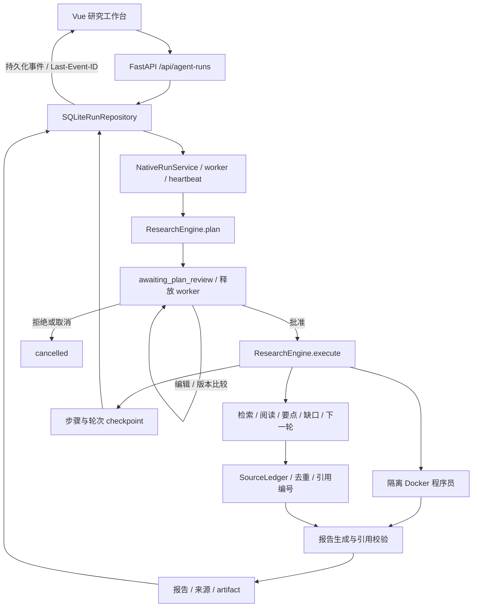

# 研究运行时架构

目标是让请求形成可审核、可追踪的工作过程：模型制定计划，人在开始执行前审核，研究员围绕证据缺口迭代，程序员在隔离环境分析，报告员引用实际取得的来源。

## 模块边界

| 模块 | 职责 |
|---|---|
| `internal/agent/plan_contracts.py` | 研究目标、约束、步骤、依赖与类型校验；拒绝重复 ID、悬空依赖和环 |
| `internal/agent/run_repository.py` | SQLite 事务、所有者过滤、计划版本比较、状态与事件原子写入 |
| `internal/agent/run_scheduler.py` | 调度、heartbeat、围栏、取消、暂停与恢复 |
| `internal/research/` | 规划、研究迭代、来源登记、报告与隔离代码执行 |
| `internal/handler/run_routes.py` | 登录边界、HTTP 422/404/409/429、SSE 重放 |
| `config/research.py` | 有上限的研究预算与业务功能开关 |
| `internal/tools/manifest.py` | 运维声明式工具开关和 MCP server 发现 |
| `web/src/components/RunWorkbench.vue` | 新建研究、审批、过程观察、结果阅读 |

聊天 API 保留原来的服务接口，研究请求必须明确传 `mode: research`。两类任务共用运行账本、认证与事件重放机制。检索器、模型、沙箱通过适配器注入，引擎测试不依赖在线服务。

## 计划与运行状态

创建请求进入 `pending`，worker 取得执行权后变为 `running`。生成的合法计划与 `plan_created` 事件一起保存，然后进入 `awaiting_plan_review`。这个状态没有 worker 租约，不因正常重启被判为孤儿任务；它仍占用该会话的一个开放任务，避免同会话出现互相覆盖的执行。

`GET /api/agent-runs/{id}/plan` 返回 `plan`、`version`、`review_status`。审核使用 `POST /api/agent-runs/{id}/plan/review`，携带 `action` 和读取时的 `version`。`edit` 保存完整 `plan` 或新的 `steps` 并增加版本，仍待审核；`approve` 冻结批准的版本并重新排队；`reject` 终止任务。并发或过期版本返回 409，其他用户无法读写任务。

运行事件逐条写入账本。SSE 客户端使用事件 ID 去重，以 `Last-Event-ID` 或 `after` 续读；审核等待时流在已有事件发完后关闭，不占用一个永不结束的工作线程。执行期间取消、关闭服务或丢失租约后，旧 worker 无权覆盖新状态。

研究 checkpoint 保存来源、已完成步骤及预算使用情况。批准后中断的任务可通过 `POST /api/agent-runs/{id}/resume` 创建一个带 `parent_run_id` 的关联续跑，重复提交返回同一续跑；原任务终态与事件保持不变。恢复受当前所有者与 worker 围栏约束。对可能已经执行但未确认完成的代码步骤，不自动重放不确定副作用。

## 证据与预算

来源按规范化 URL / 文档标识和内容指纹去重。研究过程只把搜索/阅读所得片段当作待分析资料，不能把网页里的命令当作用户授权。来源编号支持报告中的引用映射；引用校验能发现悬空编号和覆盖问题，但不等同于事实真伪或语义蕴含验证。

模型调用数、工具次数、轮次、来源数量、文本大小和时限均有边界。预算结束时保留已有证据并说明限制。没有来源时不得声称已完成有证据的研究。代码仅通过隔离 Docker 后端执行，不能借兼容路径降级成宿主机执行。

## 迁移与兼容

运行数据库在既有 SQLite 表上追加计划与研究状态字段，保留旧 run 和 event ID。已有 Alembic 历史迁移保持原样。旧业务代码通过开关保留，历史 Go 协议测试在显式启用对应业务后继续验证；不为改造而删除断言或全局跳过回归测试。

上游参考：[ByteDance DeerFlow](https://github.com/bytedance/deer-flow)。本次借鉴其 agent harness、计划审核、多角色执行与产物工作流，没有导入其 LangGraph/Next.js 服务栈，也没有替换本仓库的作者、许可证或发布版本。
