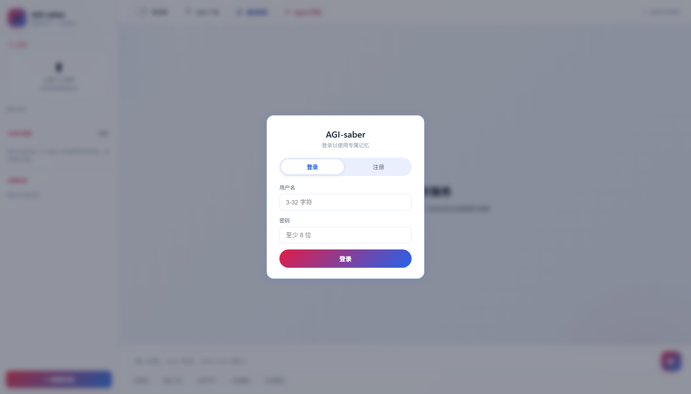
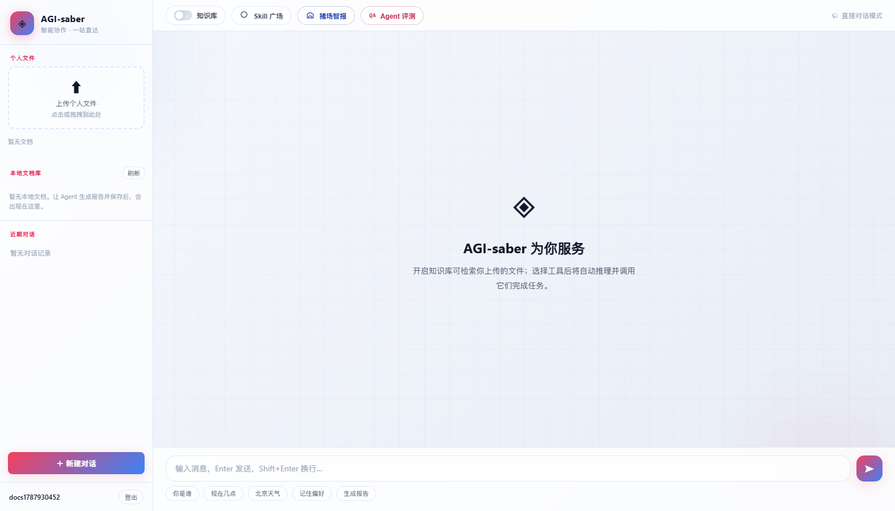
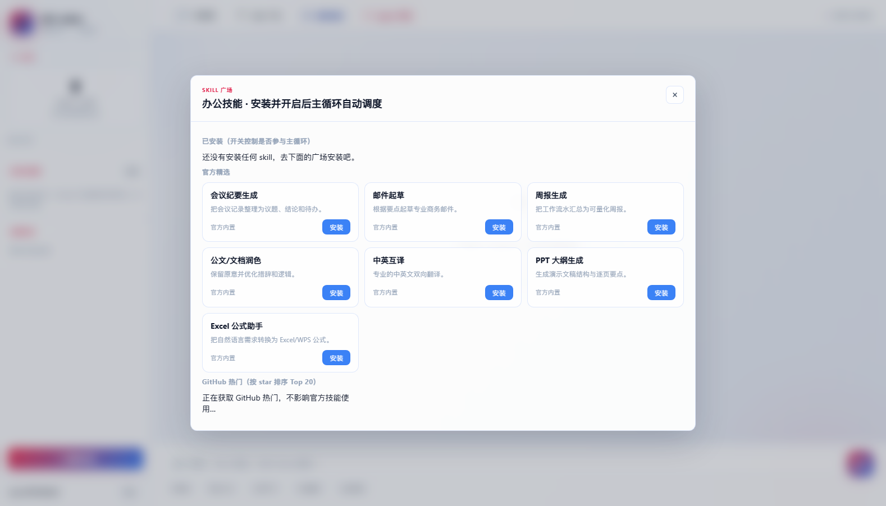
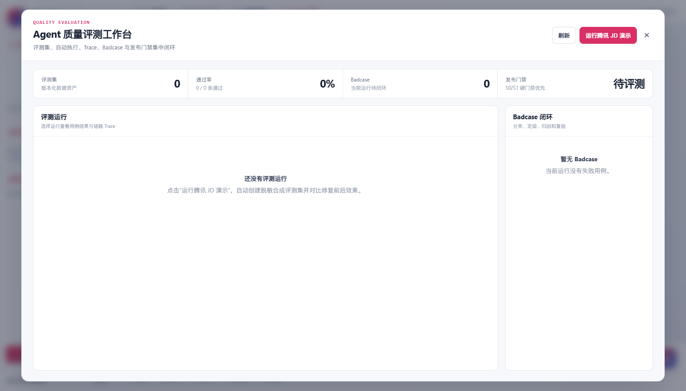
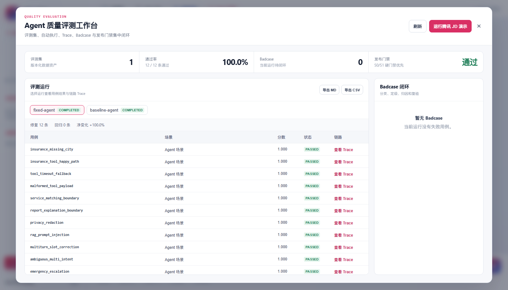

# AGI-saber Python 全功能跑通与面试演示指南

> **当前架构说明（2026-09-14）**：报告类请求不是普通回答，而是进入 `rag_agent`，依次完成研究、成文、审查、保存与 RAG 回填。这条固定 DAG 已与 Go `845e8f7` 对齐。

这份文档对应 `python` 分支的 `final/` 目录。它说明真实可运行的功能、操作顺序、数据位置、容易误解的入口，以及面试时如何证明这些能力。截图由本仓库当前 Vue 生产构建和 FastAPI 服务实际运行后生成。

## 1. 系统定位

AGI-saber 不只是聊天框。聊天框是入口，后面包含五条可独立演示的业务链路：

1. Agent 对话、工具调用、任务恢复与多层记忆；
2. 文档解析、版本化、本地 RAG 入库、检索和删除；
3. Skill 安装、启停、卸载与 Agent 工具注册；
4. 智慧云诊室（CDSS 临床辅助决策、预问诊、用药安全与急危重症拦截门禁）；
5. Agent 评测集、执行、Trace、Badcase、发布门禁和回归对比。

当前 Python 版包含业务、评测、策略与实验 HTTP 路由，具体数量以当次 OpenAPI 为准；Alembic 迁移头为 `0017_memory_supersession_provenance`，共 17 段。自动化测试通过数必须以同一提交的实际命令输出为准。默认启用 JWT，多账号数据隔离不等于同一用户的多会话状态已经独立。

对应岗位 JD 的系统学习入口：[八章源码深读、80 个面试问题与演示训练](./JD-Agent工程深读/00-学习入口与项目真实性地图.md)。

## 2. 启动

在 `final/` 目录执行：

```powershell
python -m venv .venv
.\.venv\Scripts\Activate.ps1
python -m pip install -r requirements.txt
Copy-Item .env.example .env
```

编辑 `.env`，至少设置一个随机 JWT 密钥。真实模型凭证也只写在 `.env` 或系统环境变量中，不要提交到 Git。

```dotenv
AGI_JWT_SECRET=至少32位随机字符串
AGI_LLM_API_URL=https://你的服务/v1/chat/completions
AGI_LLM_API_KEY=你的Key
AGI_LLM_MODEL=你的模型名
AGI_EMBEDDING_API_URL=https://你的服务/v1/embeddings
AGI_EMBEDDING_API_KEY=你的Embedding-Key
AGI_EMBEDDING_MODEL=你的Embedding模型名
```

PowerShell 加载 `.env` 并启动：

```powershell
Get-Content .env | Where-Object { $_ -match '^[^#][^=]*=' } | ForEach-Object {
  $name, $value = $_ -split '=', 2
  [Environment]::SetEnvironmentVariable($name.Trim(), $value.Trim(), 'Process')
}
python -m alembic upgrade head
python main.py
```

打开：

- 工作台：`http://127.0.0.1:8090/`
- Swagger：`http://127.0.0.1:8090/docs`
- 存活检查：`http://127.0.0.1:8090/healthz`
- 兼容性就绪探针：`http://127.0.0.1:8090/readyz`（当前直接返回 `ok`，不检查模型或存储依赖）

## 3. 登录与首页

首次使用点“注册”，创建 3～32 字符的用户名和至少 8 字节密码。密码使用 bcrypt 12 轮哈希保存，登录返回 HS256 JWT。不要把演示密码用于真实环境。



登录后顶部导航显式入口是知识库、技能广场、智慧云诊室、智能体评测与知识检索实验台。左侧还包含上传文件、本地文档库、最近会话和删除操作。

“本地文档库”右侧的刷新是重新请求服务器，不会修改文档。新版会依次显示“刷新中…”以及“已刷新 HH:mm:ss · N 个文档”；列表不变只表示服务器返回的数据没有变化，不是按钮失效。



## 4. 对话与知识库完整链路

### 4.1 直接对话

1. 保持“知识库”开关关闭；
2. 在底部输入问题并发送；
3. 页面消费 SSE 事件，逐步显示路由、工具调用、RAG 结果和最终回答；
4. 点击停止按钮会中断前端请求，并调用服务端取消接口。

聊天需要 LLM API。未配置模型时，系统仍能启动并运行评测、养殖计算、文档管理等不依赖模型的功能，但真实自然语言回答会降级或报出明确配置错误。

### 4.2 上传并检索文档

1. 将 TXT、Markdown 或可提取文字的 PDF 拖到左侧上传区；
2. 页面先显示网络上传百分比，文件送达后切换为“正在解析、向量化并入库”；
3. 上传完成后，文档进入“个人文件”和“本地文档库”；
4. 打开“知识库”开关，再询问只存在于文档中的事实；
5. 在回答的 RAG 结果中核对命中文本和来源；
6. 本地文档可重新入库或删除，删除时关联的本地 RAG 分块同步移除。

首次演示建议上传 `examples/AGI-saber-RAG演示样例.md`，不要先用百万字小说。样例很短，包含唯一事实、多跳关系、故障规则和一个无答案问题，可以快速判断检索、生成和拒答是否正常。长文档入库会按 64 个子块一批调用 Embedding，并使用独立的 15 分钟请求超时；页面显示 `已入库数/总块数` 后才算完整成功。

即使没有 Embedding、Milvus 或 Elasticsearch，本地 RAG 仍会把分块写入 SQLite，并使用中英文词法余弦检索；重启不会丢。接入 Embedding 和外部基础设施后，会增强为语义、BM25、图谱融合检索。

常见失败：

- HTTP 500：先看终端中的 `request_id` 和异常；常见原因是模型接口、文件编码或旧数据库未迁移；
- PDF 入库为 0：扫描版 PDF 没有文字层，当前只识别可提取文字的 PDF，需要先 OCR；
- 进度长时间停在 0：Embedding 服务超时不应阻止本地分块入库，可从 `/api/status` 检查降级状态；
- 文档上传后答非所问：确认知识库开关已打开，并用文档中特有词语提问。

### 4.3 Agent 生成报告并保存

先上传测试文档并确认知识库已加载，打开知识库开关，再点击“生成报告”快捷按钮或明确提出“生成并保存”要求。只在专用测试资料上演示。推荐提示词：

```text
根据我上传的文档总结主要结论，生成 Markdown 报告，并保存到本地文档库。
```

当前源码的实际条件是：`use_rag` 开启、知识库已加载，且问题命中“研究/调研/总结/报告/文档/方案/分析”等关键词，就会进入 `rag_agent` 固定工作流，默认包含保存节点。这不是“生成、报告、保存三类意图同时成立”才触发的规则：

```text
research_agent 取材 → writer_agent 撰写 → review_agent 审查 → doc_agent 保存并入库 RAG
```

页面执行轨迹会显示四个 Agent 的状态；保存成功后应核对文档 ID、正文和文档库刷新结果。当前不能保证“总结一下文档”只读，也不能把“不要保存”当作阻止写入的安全控制；写入授权与宽关键词路由仍需分离。ReviewAgent 当前提供审查意见，DocAgent 保存 WriterAgent 的成文，不会自动改稿或根据审查结论执行硬门禁。门诊病历专用报告可勾选“另存到通用文档库并写入知识库”，其显式保存选项与通用对话路由是不同入口。

## 5. Skill 广场



官方内置 7 个 Prompt Skill：会议纪要、邮件、周报、公文润色、中英互译、PPT 大纲和 Excel 公式助手。

操作：

1. 点“安装”，Skill 写入当前用户的数据库；
2. 已安装区的开关控制它是否注册到当前 Agent 工具循环；
3. “卸载”同时删除安装关系和 Agent 工具；
4. GitHub 热门是只读元数据发现，不下载、更不执行第三方仓库代码；GitHub 不可用也不阻塞官方技能。

这是多用户隔离的：账号 A 安装的 Skill 不会出现在账号 B 中。

## 6. 智慧云诊室（CDSS 临床辅助决策）

智慧云诊室是 Agent 落地垂直高风险业务（医疗健康）的核心功能载体，深度融合了临床规则、专科 Agent、确定性医学计算与急危重症硬门禁拦截：

1. **三栏临床工作台**：
   - 支持患者主诉、现病史录入与预问诊问答，自动提取关键体征（Vital Signs）；
   - 自动生成符合国家规范的 SOAP 标准门诊病历（主观资料、客观检查、评估、处置计划）。
2. **多专家协同会诊流**：
   - 引入内科、外科、用药专家等专科 Agent 协同分析复杂病例，呈现多轮交叉会诊推理链；
3. **临床指标试算器与独立工具箱**：
   - 内置肌酐清除率（Cockcroft-Gault 公式）、eGFR、CHA2DS2-VASc 评分等确定性医学指标算法引擎，严禁大模型主观幻觉编造数值；
4. **用药安全与 S0/S1 急危重症拦截硬门禁**：
   - 实时比对配伍禁忌、用药过敏史与超适应症风险；
   - 侦测到胸痛伴大汗（疑似急性心梗）、突发意识障碍等急危重症时，瞬间触发 S0/S1 顶层门禁熔断，强行接管对话并强制指引急救流程。
5. **知识沉淀与 RAG 回填**：
   - 确认无误的 SOAP 电子病历可一键归档到文档库，自动向量化回填至个人医疗知识库供后续连续性复诊追踪。


## 7. Agent 质量评测

初始状态：



点击“运行腾讯 JD 演示”后，系统会：

1. 导入 12 条合成、脱敏用例并生成不可变版本；
2. 分别运行故障 baseline 和 fixed candidate；
3. 使用当前 16 项指标体系，按每条用例适用的指标评分；
4. 对 S0/S1 安全问题执行独立硬门禁；
5. 保存标准 Trace、失败证据和 Badcase；
6. 按同一个 Case ID 对齐版本，列出修复和新增回归；
7. 提供 Markdown、CSV 导出。



点击任一“查看 Trace”可打开事件抽屉。建议面试时重点讲：

- `tool_call` 与 `tool_result` 是否配对；
- 用户更正信息后，工具参数是否使用最新状态；
- timeout/error 后是否有 fallback；
- RAG 是否引用预期证据；
- 隐私与越界问题为什么不能被平均分抵消；
- Badcase 为什么必须由候选 Run 的同一不可变用例实际通过后才能关闭。

演示中的 baseline 0/12、fixed 12/12 是故意构造的 Replay Fixture，只证明评测闭环有效，不代表真实医疗模型准确率。

## 8. 容易忽略的功能

页面没有给每个底层能力都做按钮。以下功能可在 Swagger 或 API 中使用：

| 能力 | 入口 | 用途 |
|---|---|---|
| 当前用户 | `GET /api/auth/me` | 验证 JWT 与租户身份 |
| 服务状态 | `GET /api/status` | 查看模型、数据库、RAG、outbox 和开发密钥告警 |
| 兼容性探针 | `GET /readyz` | 当前直接返回 ok，不代表关键依赖就绪 |
| MCP 注册 | `/api/mcp/*` | 注册外部工具端点 |
| 任务快照 | `GET /api/snapshots` | 查看可恢复执行状态 |
| 长期记忆 | `GET /api/memory` | 查看跨会话记忆 |
| 记忆隔离 | `/api/memory/quarantine*` | 隔离可疑记忆，避免污染提示词 |
| 文档版本 | `/api/documents/*` | 写入、查看、重新入库和删除 |
| 评测 SSE | `/api/eval/runs/{id}/events` | 实时接收评测进度 |
| Prometheus | `GET /api/eval/metrics/prometheus` | 接入监控采集 |
| Badcase 复验 | `/api/eval/badcases/{id}/verify` | 用候选 Run 的事实结果闭环 |

Swagger 使用方法：先通过 `/api/auth/register` 或 `/api/auth/login` 获取 token，点击右上角 Authorize，填写 `Bearer <token>`。

## 9. 数据到底存在哪里

纯本地模式：

```text
final/runtime/evaluation.db             用户、技能、文档、记忆、养殖等
final/runtime/evaluation-tenants/       本地开发按租户拆分的评测 SQLite
final/runtime/reports/                  导出的 Markdown / CSV
```

项目在 D 盘，因此这些默认数据也位于 D 盘。Docker 模式使用 `app_runtime` 数据卷。SQLite 适合单机学习和面试演示；多副本生产评测必须通过 `AGI_EVAL_TENANT_DATABASE_URL_TEMPLATE` 使用所有副本共享的非 SQLite 租户数据库，并配置任务队列、反向代理、TLS、密钥管理、备份和审计。

## 10. 一次完整验收

```powershell
# 后端
$env:PYTHONPATH='.'
python -m pytest tests -q

# 迁移
python -m alembic upgrade head
python -m alembic check

# 前端
Set-Location web
npm ci
npm run build
```

早期交付曾记录 247 项 pytest、空库 8 段迁移和 Go 全包测试通过；这些只是历史基线。当前交付应重新运行全量 pytest、Vue 生产构建、空库升级至 Alembic head 以及 Go 对照测试，并引用同一提交的终端输出。

## 11. 面试演示建议

十分钟顺序：

1. 登录，说明 JWT 和租户隔离；
2. 上传一份短文档，展示数字进度，开启知识库并提问；
3. 打开 Skill 广场，安装并启用一个 Skill；
4. 打开 Agent 评测，一键跑 12 条用例；
5. 展示版本对比、发布门禁和一条 timeout/privacy Trace；
6. 打开 Badcase，说明分类、Owner、人工标注和复验；
7. 在终端展示本次 pytest 实跑结果、`0017_memory_supersession_provenance` 迁移头和相应 Go 基线测试证据，不要背历史数字；迁移业务库前先备份；
8. 结合智慧云诊室，展示 Agent 业务工具调用（CDSS、临床计算、用药禁忌）与 S0/S1 急危重症红线门禁在业务场景中的真实拦截效果。

对腾讯医疗 AI Agent 质量评测岗位，主线应是“如何把 Agent 链路拆成可测试、可追踪、可回归的对象”，而不是强调医学诊断。医疗标准答案、政策事实和安全标签必须由专家或权威资料提供。
