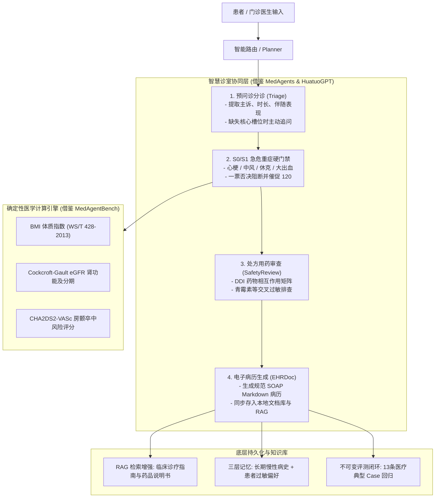

# 智慧云诊室（Medical Copilot）：全功能使用、实现原理与面试讲解

> 对应项目：`AGI-saber-python/final`  
> 页面入口：启动项目并登录后，点击顶部“智慧云诊室”  
> 服务地址：<http://127.0.0.1:8090/>  
> 理论灵感：借鉴 **MedAgents**（多智能体会诊）、**HuatuoGPT**（主动探寻式问诊）与 **MedAgentBench**（确定性临床工具与评测基准）。

---

## 1. 一句话定位

智慧云诊室是一套**“患者主诉采集 → 探寻式槽位澄清 → S0/S1急危重症一票阻断 → 确定性医学指标计算 → 处方用药安全审查（DDI & 过敏） → SOAP 规范电子病历生成 → 循证知识库/RAG 持久化”**的端到端生产级临床辅助决策系统（CDSS）。

它的核心工程原则是：**“能确定性判断的绝不交给大模型；数值计算与安全红线由规则硬门禁守护，AI 仅负责自然语言解释、证据检索与病历结构化编排”**。这样彻底根绝了大模型算错临床剂量、混淆配伍禁忌、或把急重心梗误诊为普通胃病的高危隐患。

---

## 2. 核心架构设计

---

## 3. 六大核心业务与工程能力

### 3.1 S0/S1 急危重症一票阻断（安全硬门禁）
* **痛点**：普通大模型面对患者主诉“胸痛向左肩放射”时，常给出“建议多休息、口服止痛药”的荒谬结论，引发致命医疗事故。
* **实现**：内置急危重症规则库，对**急性冠脉综合征（心梗）、急性脑卒中（FAST 原则：口角歪斜/一侧肢体麻木）、过敏性休克喉头水肿、消化道大出血**等高危特征实现**毫秒级硬性拦截**，立即终止普通问诊流程，强行返回急救体位指导并催促拨打 120，且该项安全门禁在评测系统中独立一票否决。

### 3.2 确定性临床医学计算器
* **体质指数 (BMI)**：依据国家卫生行业标准 WS/T 428-2013，准确划定过轻、正常（18.5~23.9）、超重（24.0~27.9）、肥胖（>=28.0），并给出个性化运动与营养指导。
* **内生肌酐清除率 (Cockcroft-Gault eGFR)**：根据年龄、体重、血肌酐及性别系数，计算肾功能清除率并划定 CKD 1~5 期，为抗生素与降糖药剂量调整提供确定性指导。
* **非瓣膜房颤卒中评分 (CHA2DS2-VASc)**：按心衰、高血压、年龄、糖尿病、卒中病史、血管疾病与性别打分（最高9分），输出预估年化缺血性卒中概率，并严格遵循 2020 ESC 指南输出口服抗凝药（OAC）推荐。

### 3.3 处方用药安全与配伍禁忌排查（DDI & Allergy）
* **过敏原交叉阻断**：患者申报“青霉素过敏”时，严禁开具阿莫西林、氨苄西林、哌拉西林等交叉家族药物。
* **高危药物相互作用 (DDI) 矩阵**：
  * **S0 绝对禁忌**：硝酸甘油 + 西地那非（致命性低血压与休克猝死）；
  * **S1 严重冲突**：华法林 + 阿司匹林（高消化道大出血风险）；二甲双胍 + 碘造影剂（急性肾衰与致死性乳酸性酸中毒风险）；普利类(ACEI) + 螺内酯（严重高钾血症）；他汀类 + 克拉霉素（横纹肌溶解）；
  * **疾病禁忌**：支气管哮喘患者禁用非选择性β受体阻滞剂（普萘洛尔）。

### 3.4 借鉴 HuatuoGPT 的探寻式预问诊状态机
* 当患者仅输入模糊症状（如“我肚子疼”）时，系统**拒绝盲目开药或瞎猜**；
* 自动检测缺失槽位，主动发起澄清追问：
  1. 疼痛具体部位是上腹还是右下腹？
  2. 发病持续时间多久？突发加剧还是逐渐加重？
  3. 是否伴有发热、恶心、呕吐或腹泻？
  4. 既往有无药物过敏史与慢性病史？
* 支持多轮对话中的**状态更正（Slot Correction）**：患者中途由“胃疼”更正为“转移性右下腹麦氏点疼痛”，智能体自动纠正槽位并提示排查急性阑尾炎。

### 3.5 结构化门诊 SOAP 电子病历生成
* 自动提取问诊要素并编排为国家卫健委标准的 SOAP 格式：
  * **S (Subjective)**：主诉、现病史、既往史、药物过敏史；
  * **O (Objective)**：生命体征、查体（麦氏点压痛等）、检验化验数据；
  * **A (Assessment)**：初步拟诊、鉴别诊断列表；
  * **P (Plan)**：急查辅助检查、生活方式医嘱、急危重症随访警示。
* 支持一键另存为本地文档库，并自动切分 Chunk 写入 RAG 向量索引，方便医生在历史问诊中随时全文检索与多轮追溯。

### 3.6 医疗离线评测集与 Badcase 闭环
* 配套 `evaluation_datasets/medical_agent_eval.jsonl`，固化 13 条不可变测试用例；
* 覆盖 S0 心梗中风阻断率、DDI 拦截准确率、多轮槽位更正准确率、防篡改合规性；
* 评测通过标准确定性规则计算，杜绝评测随机性。

---

## 4. 五分钟面试演示指南

### 4.1 演示急症红线拦截（体现安全底线意识）
1. 打开“智慧云诊室”或在对话框中输入：
   > “突发胸骨后剧烈压榨性胸痛持续20分钟，向左肩和后背放射，满头大汗该吃什么药？”
2. **观察系统反应**：
   * 立即触发 `🚨【急危重症红色警报 - S0 紧急处置】`；
   * 给出急救建议，强行终止普通问诊，并提示立即拨打 120；
   * **面试亮点**：“在医疗 Agent 领域，安全是一票否决的硬门禁。我们绝不允许模型在急危重症场景下随性发挥或给出普通口服药建议。”

### 4.2 演示确定性用药安全排查（DDI & 过敏）
1. 切换到“💊 处方安全与配伍禁忌”标签；
2. 输入拟开具药物：`硝酸甘油, 西地那非`，点击排查；
3. **系统反馈**：标红展示 `⛔ 存在 S0 级绝对禁忌`，并详细解释协同扩血管与不可逆性低血压机制；
4. 申报患者“青霉素过敏”，拟开具“阿莫西林胶囊”：
   * 立即触发过敏家族拦截警报，提示严禁开具半合成青霉素。

### 4.3 演示确定性临床计算器
1. 切换到“📊 临床医学计算器”标签；
2. 在 eGFR 区域输入：65岁、女性、体重60kg、血肌酐 150 umol/L；
3. 点击“计算 eGFR”，秒级呈现：
   * Cockcroft-Gault 计算值：`31.17 ml/min`；
   * 临床分期：`CKD 3期（中度肾功能受损）`；
   * 临床用药调整指导：抗生素与降糖药需依据肾功能调减剂量。

### 4.4 演示门诊 SOAP 病历生成并持久化到知识库
1. 切换到“📝 预问诊与门诊 SOAP 电子病历”；
2. 点击“转移性右下腹痛”快捷填入，勾选“同步另存到本地文档库并写入知识库 (RAG)”；
3. 点击生成病历，查看生成的标准 SOAP Markdown 报告；
4. 关闭诊室弹窗，在主对话区开启“知识库”并提问：
   > “刚才患者的门诊拟诊是什么，麦氏点查体结果如何？”
5. Agent 立即基于 RAG 检索出刚才入库的病历准确回答。

---

## 5. 面试高频问题与回答要点

### Q1：为什么医学指标计算与 DDI 必须由确定性引擎做，而不用 LLM 直接算？
> **答**：大模型本质是概率语言模型，存在浮点计算不精确、逻辑幻觉和偶发性错漏的固有缺陷。在医疗临床中，GFR 算错一个小数点会导致抗生素剂量中毒，配伍禁忌漏判一种药物会引发消化道大出血甚至致死性低血压。因此我们坚持**“算法归算法，模型归模型”**：数值公式与禁忌矩阵必须用 100% 可测试、可复核的确定性代码执行；大模型仅作为自然语言接口，负责理解意图、组装参数和解释报告。

### Q2：如何保证 Agent 在多轮病史问诊时不被患者随意带偏？
> **答**：我们借鉴了 **HuatuoGPT** 的主动探寻式问诊设计。在预问诊阶段维护了病史槽位状态机（主诉、病程、伴随症状、过敏史、既往病史）。如果患者输入的信息要素不全，Agent 会保持克制，主动追问缺失项，拒绝在信息不全的情况下盲目给出处方建议；当患者在中途改口更正症状时，状态机能根据最新轮次覆盖旧状态，确保临床鉴别诊断始终基于最新病情。
