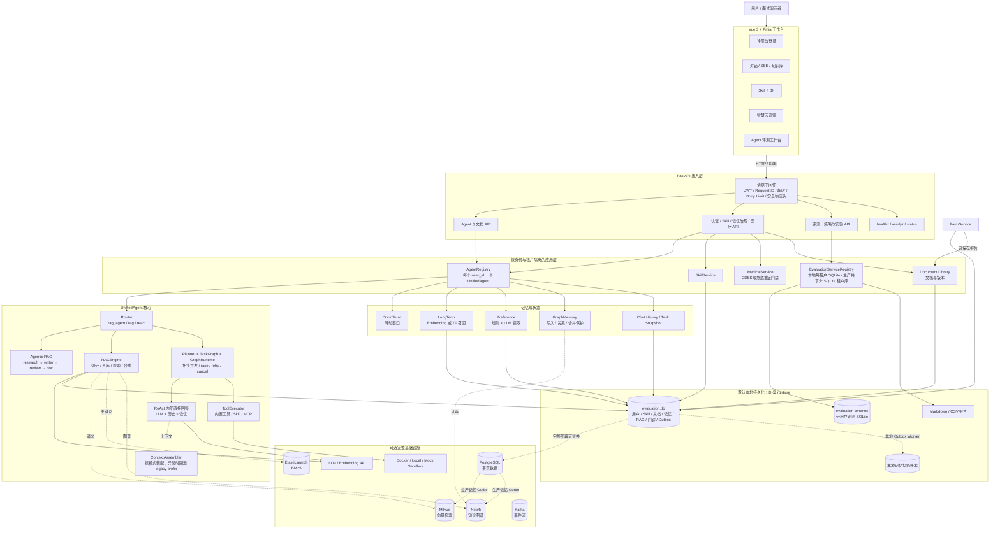
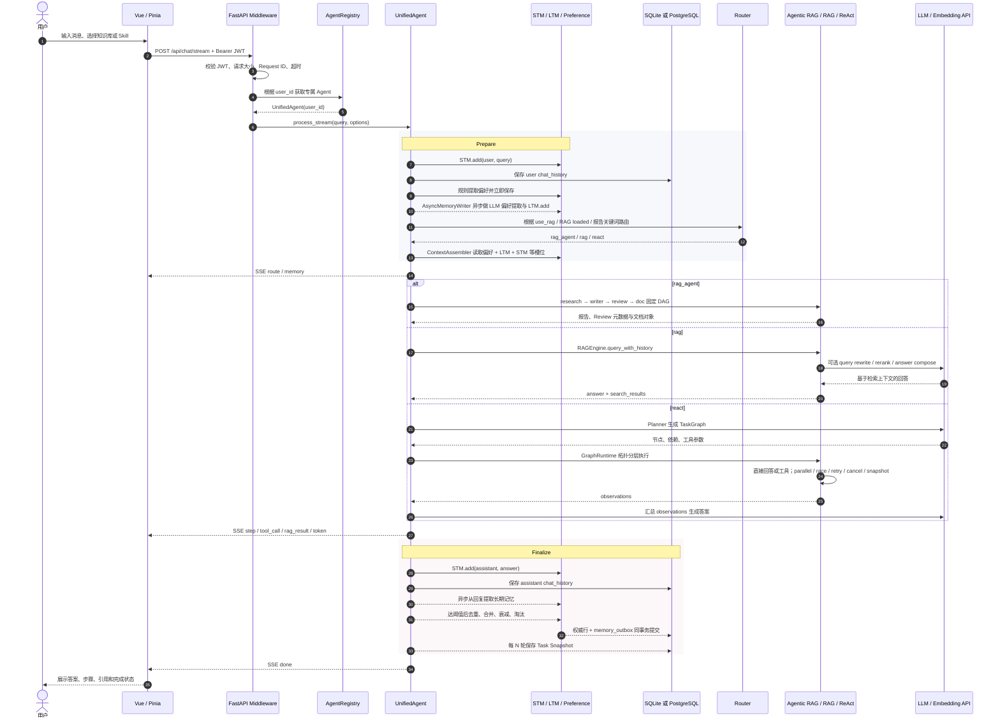
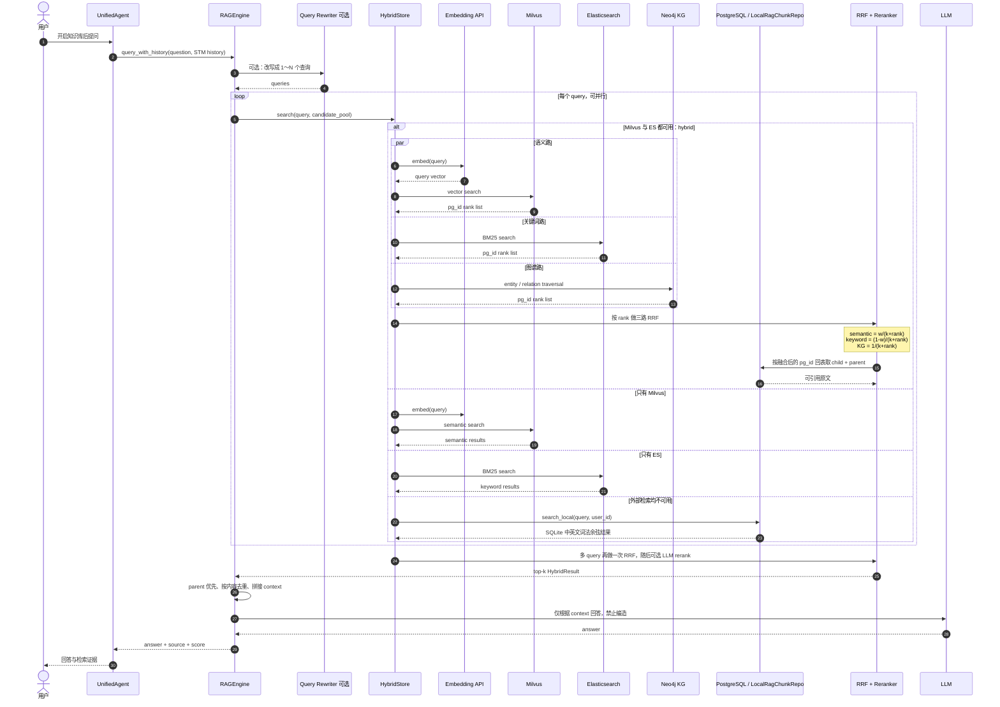
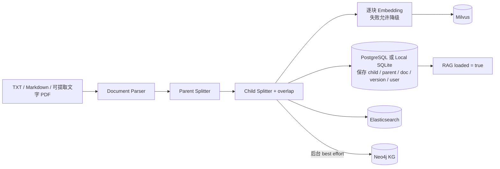
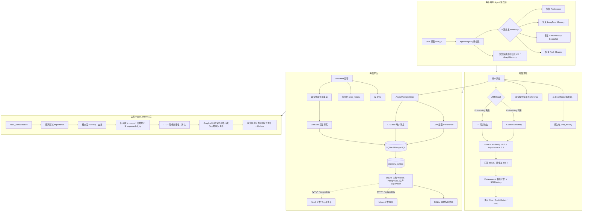

# AGI-saber Python 系统架构与核心流程图

本文以当前 `python` 分支、`final/` 目录中的实际代码为准。用户提供的截图是早期 Go 版结构示意，模块思想相近，但文件、前端、数据层和评测模块都已发生变化。

## 1. 整体架构图



### 架构结论

- 页面只是入口，核心在 FastAPI、多用户 Agent、RAG、记忆、工具编排、业务服务和评测闭环；
- 默认本地模式已经持久化，不是重启即丢的纯内存 Mock；
- PostgreSQL、Milvus、Elasticsearch、Neo4j、Kafka 是增强项，不是启动前置条件；
- 评测数据单独按用户落到 `runtime/evaluation-tenants/`，防止 Dataset、Trace、Badcase 串号。

## 2. 核心对话流程时序图



当前主循环是 `_prepare → _dispatch_mode → _finalize`。取消、流式事件、任务快照和异步记忆写入都在这条链上。

## 3. RAG 三路混合检索流程图



### 入库链路



需要准确表述：**三路融合只在 Milvus 与 Elasticsearch 都连通时进入 `hybrid` 模式**，Neo4j 可用时成为第三路；任一主检索基础设施不可用会降级为单路，二者都不可用时走本地 SQLite 词法检索。

## 4. 记忆系统详细流程图



### 当前图记忆边界

- 已进入主链路：长期记忆权威行与 Outbox 同事务提交，投影 Worker 按版本/哈希幂等执行；SQLite 更新本地账本，生产 PostgreSQL 的 Outbox 才按 Milvus/Neo4j target 拆分；
- 已有实现但当前主对话未调用：`MemoryManager.recall()` 的种子召回 + Neo4j 1-hop 扩展；
- 当前主 dispatch 通过 `_build_context_prefix()` 使用 `ContextAssembler`，装配异常时才回退 `_build_memory_system_prefix()`；
- PostgreSQL 生产消费者具备租约、指数退避、dead-letter 与周期 reconcile，但真实 Milvus/Neo4j 的断线、乱序与并发恢复仍需完整环境故障注入。

## 5. 当前真实目录结构

```text
AGI-saber-python/
├── README.md                         Python 分支总览
└── final/
    ├── main.py                       FastAPI / Uvicorn 启动入口
    ├── requirements.txt              Python 依赖
    ├── Dockerfile                    Node 构建 + Python 运行的多阶段镜像
    ├── docker-compose.yml            App + PG + ES + Milvus + Kafka + Neo4j
    ├── alembic.ini                   数据库迁移配置
    ├── .env.example                  不含真实密钥的环境变量模板
    │
    ├── config/
    │   ├── config.py                 YAML 加载、校验、环境变量覆盖、默认值
    │   └── config.yaml               非敏感默认配置
    │
    ├── internal/
    │   ├── agent/                    UnifiedAgent、Router、Planner、GraphRuntime、恢复/取消
    │   ├── application/              JWT、多用户、Skill、养殖、本地仓储、Outbox
    │   ├── document/                 文档模型、版本库与 TXT/MD/PDF 解析
    │   ├── evaluation/               Dataset、Adapter、Evaluator、Trace、Badcase、Report
    │   ├── graph/                    TaskGraph、KG 类型、实体关系抽取与存储
    │   ├── handler/                  FastAPI 路由、SSE、中间件、健康检查、静态挂载
    │   ├── infra/                    外部基础设施连接与 Repository 装配
    │   ├── llm/                      Chat / Embedding 客户端与降级
    │   ├── memory/                   STM、LTM、Preference、GraphMemory、MemoryStack
    │   ├── platform/                 PostgreSQL / ES / Milvus / Kafka / Neo4j 客户端
    │   ├── promptctx/                上下文 Schema、Slot、Source 与 Assembler
    │   ├── rag/                      Splitter、Rewriter、Hybrid RRF、Reranker、RAGEngine
    │   ├── repo/                     Chat、Document、LTM、Preference、RAG、Snapshot 仓储接口
    │   ├── sandbox/                  Docker / Local / Mock 沙箱与命令校验
    │   └── tools/                    时间、天气、搜索、RAG、文档、exec_command、MCP
    │
    ├── web/                          当前生产前端：Vue 3 + Pinia + Vite
    │   ├── src/
    │   │   ├── api/                  Bearer fetch 客户端
    │   │   ├── components/           登录、聊天、文档、Skill、养殖、评测界面
    │   │   ├── composables/          SSE 消费
    │   │   ├── stores/               auth/chat/docs/skills/farm/evaluation/sessions
    │   │   └── utils/                Markdown 与转义
    │   └── dist/                     npm run build 产物，FastAPI 优先挂载
    │
    ├── frontend/                     旧单文件 HTML，仅作为 Vue dist 缺失时的 fallback
    ├── alembic/versions/             0001～0016 迁移
    ├── examples/evaluation/          12 条合成、脱敏评测 Fixture
    ├── scripts/                      离线评测演示脚本
    ├── tests/                        单元、契约、迁移、API 与 E2E 测试
    ├── docs/                         使用、学习、面试和架构文档
    └── runtime/                      SQLite、分用户评测库和报告；Git 忽略
```

## 6. 与截图中的 Go 版对照

| 截图中的 Go 版 | 当前 Python 版 |
|---|---|
| `config.go` | `config/config.py` |
| `main.go` | `final/main.py` |
| `go.mod` | `requirements.txt` |
| `frontend/index.html` 单文件前端 | `web/src` Vue 3 + Pinia；旧 HTML 仅 fallback |
| `internal/agent` | 保留，并增加 GraphRuntime、SubAgent、Cancel、Registry |
| `internal/infra` | 保留，并拆出 `platform/` 与 `repo/` |
| 没有业务应用层 | 增加 `application/`：认证、Skill、养殖、本地持久化 |
| 没有质量评测层 | 增加 `evaluation/`：评测、策略、实验 API 与完整闭环；数量以 OpenAPI 为准 |
| 主要依赖 PG 持久化 | 增加本地 SQLite 真相源，外部基础设施可选增强 |
| 无数据库迁移目录 | 增加 Alembic 0001～0016 版本链 |

所以答案是：**目录结构和语言运行时不同，但 Go 基准链路已经完成行为级、协议级和失败语义级复刻；Python 版在此基础上扩展为“Agent 平台 + 本地持久化 + 业务场景 + 质量评测工作台”。** 逐项源码映射见 `Go-Python完全复刻对照与面试说明.md`。
