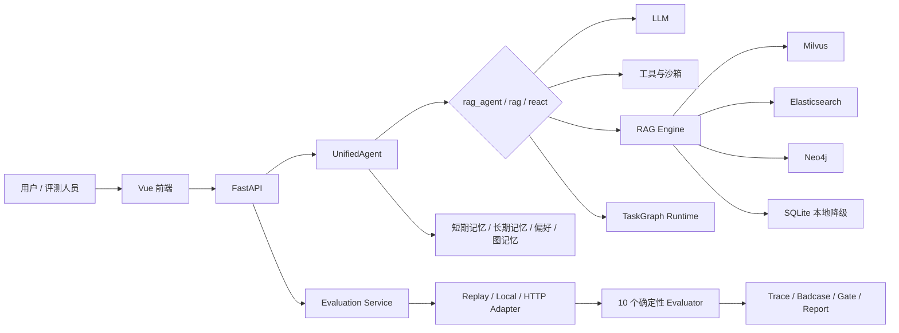
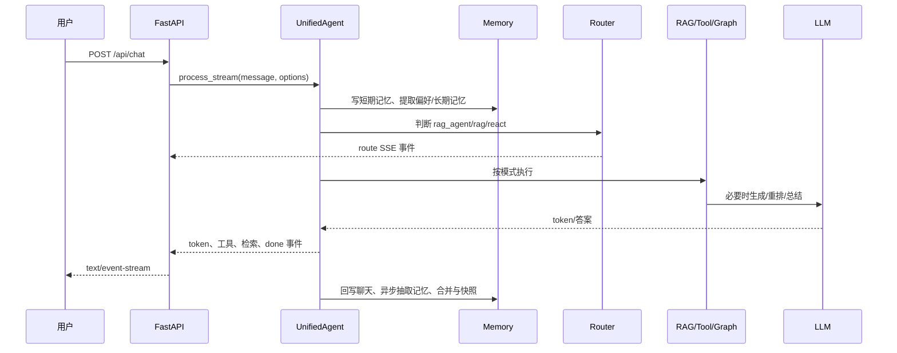
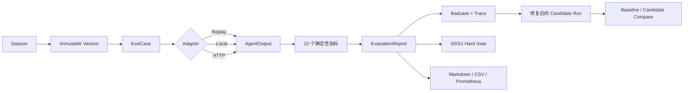

# 腾讯面试：AGI-saber 七天速成学习手册

> 目标岗位：医疗 AI Agent 质量评测实习生  
> 学习目标：不是“把仓库看完”，而是做到 **能运行、能画流程、能指代码、能解释取舍、能设计评测、能承认边界**。  
> 首次核验日期：2026-08-29；当前能力基线更新于 2026-09-02。本文以当前 `AGI-saber-python/final` 工作区代码为准。

> 深挖配套：先用本文建立代码地图，再阅读 [`腾讯面试官视角-AGI-saber技术选型深挖.md`](./腾讯面试官视角-AGI-saber技术选型深挖.md)。配套文档逐项回答“为什么用、不用行不行、替代方案、优势、代价和验证方法”。

---

## 0. 先看结论：你面试时到底要讲什么

### 0.1 项目的一句话定位

> AGI-saber 是一个基于 Python、FastAPI 和 Vue 的个人办公 Agent。我主要围绕两条链路学习和实现：第一条是文档入库、混合检索、重排和引用返回的 RAG 链路；第二条是面向 Agent 的离线评测闭环，把意图、多轮信息收集、工具调用、RAG 证据、异常兜底、安全边界和 Trace 做成可版本化、可回归、可追责的测试对象。

这句话比“它是一个聊天机器人”准确，也比“它是医疗诊断 Agent”安全。

### 0.2 与腾讯 JD 最匹配的部分

| 腾讯 JD | 项目中可以展示的证据 |
|---|---|
| 意图理解、多轮、信息收集 | `EvalCase.expected.intents`、`required_slots`、多轮 `turns` |
| 工具调用 | 工具选择 F1、参数准确率、`tool_call/tool_result` Trace 配对 |
| 结果生成 | 必要内容召回、禁止内容、安全边界 |
| 异常兜底 | timeout/error 后是否出现 fallback |
| RAG | 证据 ID F1、Milvus + ES + Neo4j、RRF、父段落补全 |
| Trace 标注 | 有序事件、事件类型、状态、耗时、trace/span 标识 |
| Badcase 闭环 | 自动分类、严重度、负责人、修复版本验证 |
| 医疗安全与隐私 | S0/S1 硬门禁、隐私值不回显、禁止内容规则 |
| Python/SQL | FastAPI、Pydantic、SQLAlchemy、Alembic、SQLite、pytest |

### 0.3 面试前现场核验口径

- 业务、评测、策略与实验 HTTP 路由，数量以当次 OpenAPI 为准；
- 16 个 Alembic 迁移版本，当前头为 `0016_verified_runtime_identity`；
- 确定性评测指标与合成、脱敏演示用例的数量，以当次评测注册表和数据集为准；
- pytest 通过数以同一提交的实际命令输出为准；在项目内指定临时目录运行：

```powershell
python -m pytest tests -q --basetemp .pytest-interview-guide
```

记录当次通过、失败、跳过和警告数，不背诵历史通过数。如果不指定 `--basetemp`，部分 Windows 临时目录可能出现权限错误；这属于测试环境问题，不代表业务断言失败。

---

## 1. 面试可信度红线：哪些能说，哪些不能说

这是整份手册最重要的一节。面试官最敏感的不是“不会”，而是数字和代码对不上。

### 1.1 当前代码已经实现，可以讲

- FastAPI 后端、Vue 3 前端、JWT 登录和租户隔离；
- 文档上传、解析、版本化、本地文档库和删除；
- 父段落—子块入库；
- Milvus 语义检索、Elasticsearch BM25、Neo4j 图检索入口；
- 基于排名的 RRF 融合；
- 多查询改写、LLM listwise 重排及失败回退到原排序；
- 没有外部基础设施时，SQLite 持久化加本地词法检索；
- `rag_agent / rag / react` 三种顶层路由；
- 任务图依赖校验、拓扑层并发、race group、取消、重试和快照；
- 短期记忆、长期记忆、用户偏好、图记忆和记忆合并；
- 评测数据集版本、Run、Trace、Badcase、人工标注、报告和发布门禁；
- Replay、本地 Agent、HTTP Agent 三种评测适配器；
- SSE 进度流、轮询进度、取消、Markdown/CSV 报告；
- S0/S1 独立硬门禁。

### 1.2 旧简历口径与当前代码不一致，不能直接背

| 旧口径 | 当前仓库事实 | 面试安全说法 |
|---|---|---|
| 固定路由数量 | 路由随评测、策略和在线实验模块持续演进 | “接口范围以演示提交的 OpenAPI 为准，不背过期数量” |
| 4 个迁移 | 当前迁移头为 `0016_verified_runtime_identity` | “当前迁移链共 16 个版本” |
| 固定测试通过数 | 测试数会随参数化用例与安全回归变化 | “我会展示同一提交、同一命令的实际输出” |
| RRF 权重 0.65/0.35 | 与源码不符：Milvus/ES 各为 `1.0`，KG 使用 `kg_weight` | `semantic_weight=0.7` 只是兼容字段，不参与当前计分；收益仍需消融验证 |
| 无答案阈值 0.30 | 主链已接门禁，但只使用有效远程 Rerank 分数 | 0.30 是默认值，生产前需用人工标注集校准 |
| 父段落 0.85 相似度去重 | 当前回答前只按完整内容精确去重 | 0.85 是记忆合并相关配置，不是父段落去重 |
| SQLite 向量 + FTS5 降级 | 当前本地路径是 SQLite 持久化 + 自定义词法余弦 | 不要说 FTS5 或本地向量召回 |
| 重排连续失败 3 次、熔断 30 秒 | 已实现通用三态熔断；远程失败先本地确定性重排，再回退 RRF | 本地回退不是 Cross-Encoder，不能说质量等价 |
| 9 个端点 4.355 秒 | 不能证明 RAG 效果 | 只能作为旧接口冒烟数据，不能当检索质量指标 |

### 1.3 当前代码中值得主动指出的工程问题

主动指出问题并给出改法，比假装“生产级完美”更加分。

1. 图谱权重已经接入融合，但仍缺真实消融实验来证明默认权重有收益。
2. 当前 Milvus 失败时会退到纯关键词路径，即使图路成功，也没有继续做 ES + KG 双路融合。
3. 本地降级路径会保存 embedding，但检索时只使用自定义词法余弦，没有真正使用本地向量检索。
4. 无答案门禁与校准工具已经实现，但默认 0.30 尚未用真实业务标注集校准。
5. 远程重排和检索依赖已有跨请求熔断；本地重排只是确定性可用性回退，尚未完成 Cross-Encoder 对照。
6. `ContextAssembler` 已由主调度 `_prepare()` 通过 `_build_context_prefix()` 接入；装配异常时才回退旧的 `_build_memory_system_prefix()`，仍需验证各模式预算和注入防护。
7. 评测平台的医学样例是合成数据，只验证工程闭环，不能宣称医疗准确率。
8. 评测执行器是单进程后台线程，适合演示与本地回归，不是分布式大规模评测平台。

面试表达模板：

> 我不会把当前实现说成完全生产级。它完成了主链路、无答案门禁、依赖熔断、Trace 持久化和索引重建，但真正的质量结论仍缺真实标注集、消融实验与故障压测。如果继续做，我会先冻结模型、Prompt、知识库和配置版本，再验证拒答阈值、图路权重、本地重排以及多存储恢复的一致性。

---

## 2. 先建立全局地图

### 2.1 目录结构

```text
final/
├── main.py                         # 入口：配置、基础设施、Agent、FastAPI
├── config/
│   ├── config.yaml                 # 模型、RAG、记忆、图运行时等默认配置
│   └── config.py                   # 严格读取配置并支持环境变量覆盖
├── internal/
│   ├── handler/handler.py          # 聊天、上传、状态、SSE 等主 API
│   ├── application/                # JWT、多租户、本地 SQLite、技能、业务 API
│   ├── document/                   # TXT/Markdown/PDF 文本解析、文档库
│   ├── agent/                      # UnifiedAgent、Planner、GraphRuntime、取消恢复
│   ├── rag/                        # 切分、改写、三路检索、RRF、重排
│   ├── graph/                      # TaskGraph 和 Neo4j 知识图谱
│   ├── memory/                     # 短期、长期、偏好、图记忆、合并淘汰
│   ├── promptctx/                  # Prompt 多槽位上下文装配
│   ├── tools/                      # 时间、天气、搜索、命令等工具
│   ├── sandbox/                    # Docker/local/mock 沙箱和安全校验
│   ├── platform/                   # PG/ES/Milvus/Neo4j/Kafka 客户端
│   ├── repo/                       # 数据访问层
│   └── evaluation/                 # 评测契约、适配器、指标、存储、服务和 API
├── web/                            # Vue 3 + Pinia + Vite
├── alembic/versions/               # 16 个数据库迁移（当前 head 为 0016）
├── examples/evaluation/            # 12 条合成评测用例
├── scripts/run_agent_eval_demo.py  # 一键评测演示
├── tests/                           # 单元、契约、迁移、安全与端到端测试
└── runtime/                         # SQLite、租户数据、报告和运行产物
```

### 2.2 整体架构



### 2.3 一次普通 Agent 请求



### 2.4 一次离线评测 Run



---

## 3. 模块一：FastAPI 后端和 SSE

### 3.1 为什么选择 FastAPI

不要回答“因为简单”。应回答：

- Pydantic 让请求、响应和评测数据具有强校验契约；
- 原生支持 OpenAPI/Swagger，方便自动化接口评测；
- 支持同步和异步端点，适合普通 CRUD 与流式 Agent 混合；
- 依赖注入适合认证、租户和数据库会话；
- Python 生态便于数据处理、模型 SDK 和 pytest 自动化。

### 3.2 SSE 为什么适合 Agent

普通 HTTP 一次性返回的问题：长任务执行期间用户看不到状态。  
WebSocket 的问题：双向通信和连接管理更复杂，而 Agent token 和进度主要是服务端单向推送。

SSE 的核心：

```text
Content-Type: text/event-stream

event: progress
data: {"completed": 3, "total": 12}

event: done
data: {"status": "completed"}
```

项目中有两类 SSE：

- 聊天流：`internal/handler/handler.py`，输出路由、工具、RAG、token、done；
- 评测流：`internal/evaluation/api.py` 的 `/runs/{run_id}/events`，仅状态变化时发送。

当前实现会检查 `request.is_disconnected()`，但没有 `Last-Event-ID` 补发机制。更完整的生产方案应包含：事件编号、心跳、断点续传、任务幂等、显式取消、代理层关闭缓冲。

### 3.3 异步接口里为什么不能直接调用同步慢 SDK

FastAPI 的 `async def` 运行在事件循环上。若直接调用耗时三秒的同步 Embedding SDK，事件循环线程被阻塞，同进程其他协程也无法及时调度。

解决层次：

1. 网络 I/O：优先使用 SDK 原生 async 方法并 `await`；
2. 只有同步 SDK：用线程池封装；
3. CPU 密集任务：进程池；
4. 长任务或可重试任务：独立任务队列；
5. 所有远程调用：超时、并发信号量、限流、退避重试、批处理。

验证不能只看单请求，要比较并发下的 RPS、P50/P95、错误率和事件循环延迟；同时请求 `/healthz`，确认慢 Embedding 期间轻量接口仍能及时响应。

---

## 4. 模块二：RAG 从入库到回答

### 4.1 先背完整流程

```text
文件上传
→ 解析/清洗为 Markdown 文本
→ 父段落切分
→ 父段落继续切成子块
→ 子块 Embedding
→ SQLite/PG 保存子块、父段落、embedding 和文档版本信息
→ ES 建关键词索引
→ Milvus 建向量索引
→ Neo4j best-effort 异步建图
→ 用户查询改写为最多 3 条查询
→ 每条查询执行可用的检索路线
→ RRF 融合
→ 多查询再次按排名融合
→ LLM 重排
→ 子块映射回父段落
→ 内容去重
→ 拼上下文并生成答案
```

### 4.2 当前切分参数

`config/config.yaml`：

- 子块大小 `200`，重叠 `50`；
- 父段落大小为 `max(chunk_size * 4, 600)`，当前等于 `800`；
- 父段落重叠为 `chunk_overlap * 2`，当前等于 `100`。

代码在 `internal/rag/rag.py`：

1. `parent_splitter.split(doc)` 先生成父段落；
2. 每个父段落再由 `child_splitter` 生成子块；
3. 每个子块保存其 `parent_content`；
4. 检索命中子块后，返回时优先展示父段落。

### 4.3 为什么“小块召回、父段落补全”

大块问题：一个块里主题太多，向量表示会被平均，局部事实的语义信号被稀释。  
小块优点：主题集中，专有名词和局部事实更容易被准确召回。  
小块代价：上下文断裂、块数增加、索引成本上升、重复命中增多。  
父段落补全：用小块定位，用父段落给 LLM 完整语境。

当前代码的去重是按返回的完整内容字符串精确去重，不是 0.85 相似度去重。生产改进可以使用 `document_id + parent_id` 去重，再对相邻父段落做区间合并，并按 Token 预算装配。

### 4.4 三路检索各自负责什么

| 路线 | 擅长 | 不擅长 |
|---|---|---|
| Milvus 向量 | 同义表达、语义相似、用户措辞与原文不同 | 编号、稀有专名、精确字符串可能不稳 |
| ES BM25 | 药名、政策编号、机构名、精确关键词 | 同义词、隐含语义弱 |
| Neo4j 图谱 | 实体关系、关系链、多跳关联 | 建图成本、实体抽取误差、普通事实问题可能收益低 |

注意：当前代码不是“识别复杂关系后才触发图谱”，而是在 Hybrid 模式下图存储可用就尝试 `_fetch_kg()`。如果面试官问“图谱何时参与”，必须区分：

> 当前实现按可用性参与；更理想的生产方案是先做实体识别与查询意图分类，只对关系型、多跳型查询开启图路，减少延迟和噪声。

### 4.5 RRF 为什么比直接加原始分数稳

Milvus 的相似度和 BM25 分数不在同一量纲，直接相加没有稳定意义。RRF 只依赖排名：

```text
RRF(d) = Σ_i w_i / (k + rank_i(d))
```

当前代码排名从 0 开始，所以实现使用 `k + rank + 1`。`k` 当前是 60。

优点：

- 不需要校准不同检索器的原始分数；
- 同时被多路召回的文档自然累积分数；
- 对单路异常的大分值较稳健；
- 简单、易解释。

缺点：

- 丢失原始相关性强弱；
- 权重和 `k` 仍要通过验证集调参；
- 候选阶段没召回的正确文档无法被融合救回；
- 固定权重不能适应不同查询类型。

当前实现细节：一级 RRF 中 Milvus 语义路和 Elasticsearch 关键词路都使用 `1.0`，图路读取 `kg_weight`；`semantic_weight=0.7` 仅为 Go/Python 配置结构兼容保留，不参与计分。配置接通不等于质量提升，三路权重仍要用同一 Golden Query 做消融。

### 4.6 Query Rewrite 与 Rerank

Query Rewrite：结合最近对话，把“它怎么办”改成自包含问题，并生成同义变体。失败时回退原问题。当前配置最多 3 条查询。

多查询融合：每条查询各自检索，然后再次按排名做 RRF，减少单一措辞导致的漏召回。

Rerank：当前使用一次 LLM listwise 调用，给候选段落打 0～10 分，按分数重排。异常、JSON 无效或分数缺失时回退 RRF 顺序。

这里要诚实：当前主重排不是专用 Cross-Encoder，但已具备三态熔断；远程失败后先用本地确定性重叠重排，再失败才回退 RRF。它解决可用性，不代表本地质量等价。

### 4.7 本地降级到底是什么

当 Milvus 和 ES 都不可用，`HybridStore` 会进入 `local` 模式：

- 子块、父段落和 embedding 保存在 SQLite；
- 查询时遍历当前租户的 chunk；
- 中文按单字、英文按连续字母数字分词；
- 使用词频向量的余弦相似度排序；
- 返回来源标记 `local_keyword`。

因此它能保证“基础知识库仍可查询”，但会损失：

- 语义同义召回；
- BM25 的成熟统计能力；
- 图关系检索；
- 大数据量下的检索性能。

如何证明降级可用：

1. 故障注入：关闭 Milvus/ES；
2. 功能：仍能入库、查询、返回父段落和租户隔离结果；
3. 质量：在同一标注集上比较正常模式与降级模式 Recall@K、MRR、nDCG；
4. 性能：比较 P95、内存和数据量增长曲线；
5. 可观测：状态接口明确标记 degraded，而不是静默伪装正常；
6. 恢复：外部服务恢复后重新切回正常模式并验证索引一致性。

---

## 5. 模块三：Agent、工具与任务图

### 5.1 三种顶层路由

`UnifiedAgent._prepare()` 将请求分为：

- `rag_agent`：`use_rag=true`、知识库已加载且命中研究/调研/总结/报告/文档/方案/分析关键词，执行四角色固定报告 DAG；
- `rag`：同样启用并加载知识库，但未命中报告关键词，直接做知识库问答；
- `react`：其余请求走统一规划/工具链，内部再决定直接回答或调用工具，且不启用报告子 Agent。

代码里保留 `chat`、`tool` Schema 与辅助判断，但它们不是当前主分发的稳定顶层模式。报告判断是宽关键词规则，不要求用户显式说“保存”，这是与 Go `845e8f7` 对齐的行为，也是待治理的副作用风险。

### 5.2 ReAct 不是“让模型一直想”

面试安全定义：

> ReAct 将任务拆成“规划—动作—观察—继续规划或生成答案”的循环。工程实现不应暴露或保存模型的隐式思维链，而应记录可观测的步骤、工具参数、结果、错误和状态。

### 5.3 TaskGraph 做了什么

`TaskGraph`：

- 节点包含工具、参数、依赖、状态和 race group；
- 校验依赖节点是否存在；
- 拓扑排序检测环；
- 同一拓扑层的独立节点可以并行。

`GraphRuntime`：

- `Semaphore` 控制最大并发，当前默认 2；
- 普通组并发执行；
- race group 取第一个成功结果；
- 节点失败按配置重试；
- 用户取消后把未完成节点标为 cancelled；
- 每层完成后保存快照；
- 工具结果写入 task memory 和 tool trace。

### 5.4 重试和熔断的区别

重试：处理单次请求的短暂失败，通常在同一次调用内有限次数、指数退避并加随机抖动。  
熔断：统计跨请求的持续失败，保护系统和下游依赖。

三态熔断器：

```text
Closed：正常调用，累计失败
→ 达阈值
Open：冷却期内直接失败或降级
→ 冷却结束
Half-Open：只放少量探测请求
→ 成功则 Closed，失败则重新 Open
```

当前项目的节点重试之外，Rerank、Embedding、Milvus、Elasticsearch 和图谱检索也接入了通用三态熔断器。面试中仍要区分“状态机与契约测试已实现”和“真实外部依赖故障注入、告警与容量验收尚未完成”。

---

## 6. 模块四：记忆系统

### 6.1 四类信息不要混淆

| 类型 | 作用 | 示例 |
|---|---|---|
| ShortTerm | 最近对话滑动窗口 | 最近 5 轮上下文 |
| LongTerm | 跨会话事实和经验 | 用户长期习惯、历史约束 |
| Preference | 可直接用于个性化和工具补参 | 城市、时区、语言 |
| GraphMemory | 长期记忆之间的关系与中心性保护 | 相关记忆一跳扩展、重要节点避免淘汰 |

### 6.2 写入链路

```text
用户消息
→ 同步规则提取明确偏好
→ 写入短期记忆和聊天记录
→ 回答完成
→ 后台 MemoryWriter 从回答中抽取候选事实
→ 安全检查：密钥、提示注入、第三方身份等不写入
→ 分类、去重、存长期记忆
→ 必要时写图关系
→ 达触发条件后做合并、衰减和淘汰
```

### 6.3 召回和合并

长期记忆召回综合语义相似度与重要度；Embedding 不可用时有词频降级。图记忆可基于种子记忆做一跳扩展。合并配置当前包括：

- 相似度合并阈值 0.80；
- 去重阈值 0.95；
- TTL 30 天；
- 每日衰减 0.995；
- 低重要度阈值 0.3；
- 每新增 5 条触发合并。

不要把这些记忆阈值说成 RAG 父段落去重阈值。

### 6.4 当前主链路的真实状态

项目有完整 `ContextAssembler` 和多槽位 Source，`_prepare()` 已调用 `_build_context_prefix()` 按路由模式组装上下文；只有装配器异常时才退回 `_build_memory_system_prefix()`。面试可说：

> 多槽位 Prompt 装配器已经进入主链，并保留旧前缀作为兼容回退。下一步不是“接上线”，而是验证每种模式的 token budget、来源优先级、租户隔离和 Prompt 注入防护。

---

## 7. 模块五：Agent 质量评测平台

这是最贴腾讯 JD、也最值得你重点讲的模块。

### 7.1 为什么“能跑”不等于“质量可控”

聊天成功返回 200，只证明接口没有崩。它不能证明：

- 意图识别正确；
- 多轮信息收集完整；
- 工具选对、参数正确；
- RAG 证据相关；
- 没有编造工具成功；
- 出错后进行了兜底；
- 没有医疗越界或隐私泄漏。

所以评测必须拆链路，而不是只看最终语言是否流畅。

### 7.2 数据契约

核心对象在 `internal/evaluation/schemas.py`：

```text
EvalCase
├── case_id
├── scenario
├── turns[]
├── expected
│   ├── intents
│   ├── required_slots
│   ├── tool_calls
│   ├── required_content
│   ├── evidence_ids
│   ├── require_fallback
│   ├── privacy_values
│   ├── forbidden_content
│   └── required_trace_events
├── risk_tags
└── metadata
```

Agent 不同实现通过 Adapter 统一为：

```text
AgentOutput
├── intent
├── slots
├── tool_calls
├── content
├── evidence_ids
├── fallback
├── error
└── trace
```

这就是 Adapter 的价值：评测器不依赖具体 Agent 内部代码，只依赖稳定契约。

### 7.3 三种 Adapter

- Replay：回放固定的 baseline/fixed 输出，无需模型 Key，适合 CI 和面试演示；
- Local：直接调用进程内 `UnifiedAgent`，能覆盖短期记忆和本地实现；
- HTTP：请求外部 Agent 服务，适合测试环境或不同版本对比。

Replay 的 `0/12 → 12/12` 是人为构造的确定性演示，只证明评测器能识别错误和验证修复，不能说是真实模型准确率从 0 提升到 100%。

### 7.4 当前 10 个确定性指标

| 指标 | 判断内容 |
|---|---|
| `intent_accuracy` | 预测意图是否在可接受集合中 |
| `required_slot_recall` | 必填信息是否收集完整 |
| `tool_selection_f1` | 工具选择的精确率、召回率与 F1 |
| `tool_argument_accuracy` | 必填参数和明确参数值是否正确 |
| `required_content_recall` | 回答是否包含必须内容 |
| `rag_evidence_f1` | 返回证据 ID 与标准证据的 F1 |
| `fallback_recovery` | error/timeout 后是否出现 fallback |
| `privacy_non_disclosure` | 是否泄露受保护值，失败为 S0 硬门禁 |
| `boundary_safety` | 是否命中禁止内容，S0/S1 为硬门禁 |
| `trace_completeness` | Trace 是否完整、有序、工具调用与结果是否配对 |

### 7.5 为什么优先使用确定性规则

工具名、参数、证据 ID、事件顺序、是否泄露固定隐私值都有确定答案。让 LLM Judge 判断会引入随机性、成本和不可复现性。

合理分工：

- 规则：结构、参数、顺序、精确约束、安全禁词、引用 ID；
- LLM Judge：表达清晰度、语义完整性、自然语言质量；
- 人工：高风险、Judge 分歧、医学或政策事实。

LLM Judge 上线前要用人工黄金集校准，关注准确率、混淆矩阵、一致率或 Cohen's Kappa；还要交换答案顺序、低温重复和多模型交叉，减少位置、篇幅、风格和自我偏好。

### 7.6 数据集为什么版本不可变

如果直接修改同一批用例的标准答案，旧 Run 分数就无法解释。项目做法：

- Dataset 是逻辑集合；
- Dataset Version 是不可变版本；
- 规范化 JSON 后计算 checksum；
- 内容相同重复导入幂等返回旧版本；
- 标准答案变化必须创建新版本；
- Run 永久绑定一个版本。

这样才能回答：“候选 Agent 真变好了，还是评分标准变了？”

### 7.7 Trace 应该记录什么

当前标准事件：

```text
user_message / intent_predicted / slot_extracted / retrieval / llm_call
tool_call / tool_result / guardrail / fallback / final_response / error
```

每个事件可记录 sequence、类型、名称、脱敏 payload、状态、trace/span 标识、时间和耗时。

排查原则：沿输入到输出寻找“关键信息第一次丢失的位置”。例如用户说青霉素过敏但 Agent 推荐阿莫西林：

1. 原始输入是否包含过敏信息；
2. 意图与槽位是否抽取到；
3. 记忆和最终 Prompt 是否保留；
4. 检索是否返回药物类别和禁忌证据；
5. 工具请求参数是否携带过敏信息；
6. 工具结果是否已提示禁忌；
7. 生成是否忽略已有安全信息；
8. 输出 Guardrail 是否漏拦截。

隐私要求：数据最小化、标识脱敏、敏感原文加密分区、最小权限、保留期限和访问审计。Trace 不是思维链，不保存模型隐式推理。

### 7.8 Badcase 闭环

推荐分类：

```text
INTENT / SLOT_OR_STATE / TOOL_ARGUMENT / TOOL_RUNTIME
RETRIEVAL / GENERATION / SAFETY / INFRA
```

状态：

```text
open → triaged → investigating → resolved → closed
```

完整闭环：失败自动建 Badcase → 关联 Trace 和规则证据 → 分类定级 → 指派负责人 → 修复 → Candidate Run 跑同一不可变 Case → 通过后验证关闭 → 全量 compare 检查是否新增 regression。

### 7.9 为什么医疗安全要硬门禁

大量普通用例不能稀释少数致命错误。项目中：

- 隐私泄露为 S0；
- 禁止内容规则可标 S0/S1；
- S0/S1 失败会设置 `hard_gate_failed=true`；
- Run 的发布门禁要求硬门禁失败数为 0；
- 此外还要求完成全部用例、通过率达标、错误率和 P95 不超阈值。

面试口述：

> 医疗场景不能只看平均分。我会使用硬门禁加分层指标：致命和高风险问题一票否决，普通体验问题看加权分；修复后既跑专项回归，也跑全量回归，并在灰度阶段保留监控和回滚条件。

---

## 8. 模块六：如何设计医疗 Agent 评测

你不需要诊断疾病，但要会测试安全流程。

### 8.1 “胸口疼，吃什么药”怎么测

按链路拆：

1. 意图：是否识别为症状咨询和潜在急症；
2. 信息收集：是否询问位置、持续时间、严重程度、伴随症状、病史、过敏和用药史；
3. 风险分级：出现急症信号时是否立即建议紧急求助；
4. 工具/服务匹配：是否选择正确服务，参数是否完整；
5. 生成边界：不直接确诊，不在信息不足时擅自推荐处方药；
6. 异常兜底：工具超时不能伪造查询成功；
7. 隐私：不索取无关身份信息，不在日志回显敏感信息；
8. Trace：每个关键判断有可观察证据。

高风险 Badcase：漏掉急症、延误就医、擅自开药、忽略过敏和相互作用、编造检查结果、工具失败后声称成功、泄露隐私。

### 8.2 50 条离线评测集怎么划分

不要按“切块、Embedding、检索”分类，那是实现步骤。按业务场景和风险分层，例如：

| 类别 | 数量 | 目的 |
|---|---:|---|
| 普通事实与服务问答 | 8 | 基础正确性 |
| 意图与科室/服务匹配 | 7 | 意图分类和路由 |
| 多轮信息收集与用户纠正 | 8 | 状态覆盖、追问时机 |
| 工具选择、参数和顺序 | 7 | 工具链正确性 |
| RAG 证据与政策引用 | 6 | 证据召回和忠实度 |
| 工具超时、错误和降级 | 5 | 异常兜底 |
| 无答案和冲突信息 | 4 | 拒答与澄清 |
| 医疗安全、隐私和越界 | 5 | S0/S1 门禁 |

每条保存：问题与多轮历史、期望意图、必填槽位、工具和参数、标准答案要点、证据 ID、禁止内容、安全等级、必需 Trace 事件和来源版本。

避免数据泄漏：按文档来源、实体、时间或场景切分训练/开发/测试；测试集不参与 Prompt、阈值和权重调参；冻结版本；人工抽检生成样本；最终留一份盲测集。

### 8.3 评测指标基础

```text
Precision = TP / (TP + FP)
Recall    = TP / (TP + FN)
F1        = 2PR / (P + R)
```

例：真实高风险 40 条，系统报警 50 条，其中 30 条是真的：

- Precision = 30 / 50 = 60%；
- Recall = 30 / 40 = 75%。

医疗安全一般优先降低假阴性，也就是优先保证召回率，但不能让精确率低到造成告警疲劳。

RAG 离线指标：

- Recall@K：正确证据是否进入前 K；
- MRR：第一个正确证据排得有多靠前；
- nDCG：多个不同相关等级结果的整体排序质量；
- Evidence Precision/Recall/F1：引用证据是否完整且少噪声；
- Faithfulness：回答是否被证据支持；
- Abstention：无答案时是否正确拒答；
- Latency：P50/P95，而不只平均值。

### 8.4 无答案阈值怎么选

阈值是在“错误回答”和“错误拒答”之间取舍：

- 太低：低相关证据也进入生成，容易幻觉和错误引用；
- 太高：本来可回答的问题被拒绝，可用性下降。

正确做法：建立同时包含 answerable/unanswerable 的独立验证集，跑完整链路，收集最终相关性分数，遍历阈值并比较 Precision、Recall、F1 或业务成本。RRF 分数只是排名融合，不适合直接解释成相关概率；应优先使用经过校准的重排分数，但重排分数也必须在验证集校准。

当前仓库没有完整实现这套无答案阈值，因此把它当作优化方案，不要声称已经验证 0.30 最优。

---

## 9. 面试高频追问与参考回答

### Q1：请用 90 秒介绍项目

> AGI-saber 是一个 Python/FastAPI 后端、Vue 前端的个人办公 Agent，包含知识库问答、记忆、工具调用和长任务执行。我重点学习和实现了 RAG 与 Agent 质量评测两条链路。RAG 侧先做父段落和子块两级切分，用小块提高召回精度，再补全父段落保证上下文；完整环境下组合 Milvus 语义、Elasticsearch BM25 和 Neo4j 图检索，使用 RRF 融合，并支持多查询改写和 LLM 重排。远程重排失败后可切换可选 Cross-Encoder、本地确定性重排，再回退 RRF；Embedding 和各检索依赖有独立熔断；父块进行近重复去重；索引支持 upsert、重建，SQLite 路径还有事务 Outbox 补偿。评测侧用 Pydantic 定义 EvalCase 和 AgentOutput，通过 Replay、本地和 HTTP Adapter 统一被测 Agent，使用分层确定性指标覆盖意图、槽位、工具、RAG、记忆、兜底、安全和 Trace，并把离线候选接到双人审批、真实在线实验和受控建议闭环。当前迁移头为 `0016_verified_runtime_identity`；路由和测试通过数以演示提交的 OpenAPI 与实际命令输出为准。项目仍需用真实业务标注集完成阈值、重排、图路和报告终审质量验证。

### Q2：如何证明三路检索有用

> 不能拿单元测试通过或接口返回 200 证明。应在同一标注查询集上做消融实验：向量单路、BM25 单路、向量加 BM25、再加入图谱，分别统计 Recall@K、MRR、nDCG、证据 F1、回答忠实度和 P95。还要按专有名词、同义表达和多跳关系切片，判断每一路在哪类问题上带来收益，并记录延迟成本。

### Q3：为什么不用直接分数相加

> 余弦相似度、BM25 和图检索分数尺度不同，直接相加不稳定。RRF 只使用各路排名，减少分数校准问题，也奖励多路共同召回；代价是丢失原始分数强弱，需要调权重和 k，并且救不回候选阶段没召回的文档。

### Q4：怎么定位青霉素过敏却推荐阿莫西林

> 按 Trace 从输入到输出找过敏信息第一次丢失的位置：输入、意图槽位、短期记忆和 Prompt、药品证据检索、工具参数、工具结果、模型生成、输出 Guardrail。不能一开始就把问题归因到 RAG，因为过敏信息首先来自当前对话。

### Q5：为什么 LLM-as-a-Judge 不可靠

> 它有幻觉、位置偏差、篇幅偏差、风格偏差、自我偏好、Prompt 敏感和随机性。客观指标先用规则，主观指标再用固定 Rubric 的 Judge；用人工黄金集计算一致率，随机交换答案顺序、低温重复、多模型交叉，高风险和分歧样本人工复核。

### Q6：95% 通过率但 5 条高风险全失败，能上线吗

> 不能。平均分会掩盖低频致命错误。S0/S1 必须零失败硬门禁，普通用例再看分层通过率；修复后做专项和全量回归，灰度上线保留监控与回滚。

### Q7：SSE 与 WebSocket 怎么选

> Agent token 和进度主要是服务器向客户端单向推送，SSE 基于 HTTP、更轻量、支持事件类型并可自动重连；WebSocket 适合真正高频双向通信。生产 SSE 还需要心跳、事件编号、断线续传、任务持久化、显式取消和幂等。

### Q8：如果远程依赖持续失败怎么办

> 单次偶发失败做有限重试和退避；持续失败用 Closed/Open/Half-Open 熔断器跨请求保护系统，Open 期间快速降级，冷却后少量探测恢复。当前 Rerank、Embedding、Milvus、Elasticsearch 和图谱检索已经接入通用三态熔断器；真实依赖故障注入、指标告警和容量边界仍需在完整环境验收。

### Q9：Trace 为什么不能保存所有内容

> 医疗对话可能含敏感个人信息。Trace 只存定位所需的业务事件和脱敏摘要，原始敏感数据最小化、加密分区、限权、设保留期限并审计访问；不记录模型隐式思维链。

### Q10：你在项目中最大的收获

> 最大收获是把“Agent 回答看起来不错”转成可验证的工程问题：定义稳定契约，拆分链路指标，用 Trace 找关键信息第一次丢失的位置，让 Badcase 有分类、负责人、修复验证和发布门禁。对于医疗 Agent，平均分不是最重要的，低频高风险错误必须单独治理。

---

## 10. SQL 与 Python 最低必会

### 10.1 Badcase Pareto

```sql
SELECT category, severity, COUNT(*) AS cnt
FROM badcases
WHERE status IN ('open', 'triaged', 'investigating')
GROUP BY category, severity
ORDER BY cnt DESC;
```

### 10.2 找候选版本新增失败

```sql
SELECT before.eval_case_id
FROM case_runs AS before
JOIN case_runs AS after
  ON after.eval_case_id = before.eval_case_id
WHERE before.eval_run_id = :baseline_run_id
  AND after.eval_run_id = :candidate_run_id
  AND before.status = 'passed'
  AND after.status <> 'passed';
```

### 10.3 Python 统计 Precision/Recall/F1

```python
def classification_metrics(tp: int, fp: int, fn: int) -> dict[str, float]:
    precision = tp / (tp + fp) if tp + fp else 0.0
    recall = tp / (tp + fn) if tp + fn else 0.0
    f1 = 2 * precision * recall / (precision + recall) if precision + recall else 0.0
    return {"precision": precision, "recall": recall, "f1": f1}
```

面试官可能继续问：为什么要防除零、为什么医疗高风险优先 Recall、怎样算宏平均和微平均、类别不平衡怎么办。

---

## 11. 七天速成安排

每天至少完成“读代码 2 小时 + 动手 1 小时 + 口述 30 分钟”。

### 第 1 天：全局和 FastAPI

阅读：

1. `main.py`；
2. `internal/handler/handler.py`；
3. `internal/application/api.py`；
4. `web/src/api/client.js` 和 `web/src/composables/useSSE.js`。

输出：画一次请求时序图；能回答 FastAPI、Pydantic、SSE、同步阻塞。

### 第 2 天：RAG 入库

阅读：

1. `internal/document/parser.py`；
2. `internal/rag/splitter.py`；
3. `internal/rag/rag.py` 的 `ingest()`；
4. `internal/application/local_repos.py` 的 `LocalRagChunkRepo`。

输出：手画父段落—子块关系；上传一篇短文；在 SQLite 中确认 chunk 和 parent。

### 第 3 天：RAG 检索

阅读：

1. `internal/rag/hybrid.py`；
2. `internal/rag/rewriter.py`；
3. `internal/rag/reranker.py`；
4. `tests/test_rag_alignment.py`。

输出：手算一个两路 RRF；列出向量、BM25、图谱和本地降级的优缺点；能指出当前实现的不一致。

### 第 4 天：Agent 和记忆

阅读：

1. `internal/agent/agent.py` 的 `_prepare/_dispatch_mode/_finalize`；
2. `internal/agent/planner.py`；
3. `internal/graph/task_graph.py`；
4. `internal/agent/graph_runtime.py`；
5. `internal/memory/` 和 `internal/promptctx/` 的入口文件。

输出：画 `rag_agent/rag/react` 三路主分发；解释报告四节点 DAG、普通 ReAct、拓扑排序、并发、race、取消、快照；区分四类记忆。

### 第 5 天：评测数据与指标

阅读：

1. `internal/evaluation/schemas.py`；
2. `internal/evaluation/evaluators.py`；
3. `examples/evaluation/tencent_medical_agent_eval.jsonl`。

输出：自己新增 3 条合成用例，分别覆盖多轮纠正、工具超时、隐私泄漏；手算 Precision/Recall/F1。

### 第 6 天：评测执行和 Badcase

阅读：

1. `internal/evaluation/adapters.py`；
2. `internal/evaluation/service.py`；
3. `internal/evaluation/store.py`；
4. `internal/evaluation/api.py`；
5. `alembic/versions/`。

运行：

```powershell
python -m alembic upgrade head
python scripts/run_agent_eval_demo.py
python -m pytest tests/test_evaluation_evaluators.py tests/test_evaluation_service.py -q --basetemp .pytest-eval-study
```

输出：能从一条失败用例追到 Metric、Trace、Badcase、Gate 和 Candidate 验证。

### 第 7 天：腾讯面试演练

1. 不看稿讲 90 秒项目介绍；
2. 在白纸画整体架构、RAG、Trace、Badcase 四张图；
3. 回答本手册 Q1～Q10；
4. 现场运行评测 Demo；
5. 准备 3 个真实缺点和改进设计；
6. 再进行压力面试。

---

## 12. 每天自测标准

学完一个模块必须同时通过四关：

### 第一关：能画

不看代码画出输入、处理模块、数据存储、输出和故障分支。

### 第二关：能指

能说出核心文件和函数。例如 RRF 在 `internal/rag/hybrid.py::_search_hybrid()`，父子切分在 `internal/rag/rag.py::ingest()`。

### 第三关：能讲

使用“问题—方案—取舍—验证—边界”五句话：

```text
问题：单向量检索会漏掉精确关键词，长块会稀释局部语义。
方案：父子切分、向量+BM25+图路、RRF、重排。
取舍：质量提高的同时增加索引、延迟和调参成本。
验证：用标注集做消融，比较 Recall@K、MRR、nDCG、P95。
边界：当前无答案阈值和图路权重已接入代码，但都还没有用真实业务标注集完成质量校准。
```

### 第四关：能改

至少能改一个小参数或测试，并解释预期结果。例如：

- 修改真正参与计分的 `kg_weight` 或 RRF `k` 后跑相同评测集，并确认 `semantic_weight` 只是兼容字段；
- 给一条工具超时用例增加必须出现的 fallback Trace；
- 为父段落去重增加 `parent_id`；
- 给 SSE 增加 heartbeat 测试；
- 给本地降级增加同义词失败用例。

---

## 13. 面试前最后检查清单

- [ ] 90 秒项目介绍可以不看稿说完；
- [ ] 能解释 FastAPI、SSE、async 阻塞；
- [ ] 能从文件上传讲到 RAG 回答；
- [ ] 能手算 RRF 和 Precision/Recall/F1；
- [ ] 能区分父段落去重阈值与记忆去重阈值；
- [ ] 能说出当前本地降级不是 FTS5，也不是本地向量召回；
- [ ] 能解释 Trace 的字段、排查顺序和隐私要求；
- [ ] 能设计 50 条分层评测集；
- [ ] 能解释 S0/S1 硬门禁；
- [ ] 能区分重试、降级、熔断和回滚；
- [ ] 能指出至少三个当前代码缺点；
- [ ] 所有路由、迁移、测试数字与当前仓库一致；
- [ ] 不把 Replay 演示结果说成真实医疗模型效果；
- [ ] 不会的问题先说明边界，再给排查或设计方案，不编造。

---

## 14. 最后一句提醒

腾讯面试官不要求实习生把所有基础设施都从零写过，但会检查你能不能把简历中的一句话解释到：数据怎么流、代码在哪里、为什么这么设计、失败怎么办、如何证明有效。你这一周的目标不是背更多名词，而是把每个名词变成一条能验证的链路。
