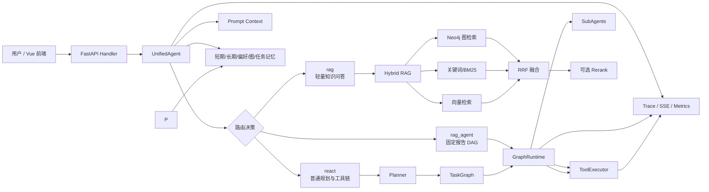
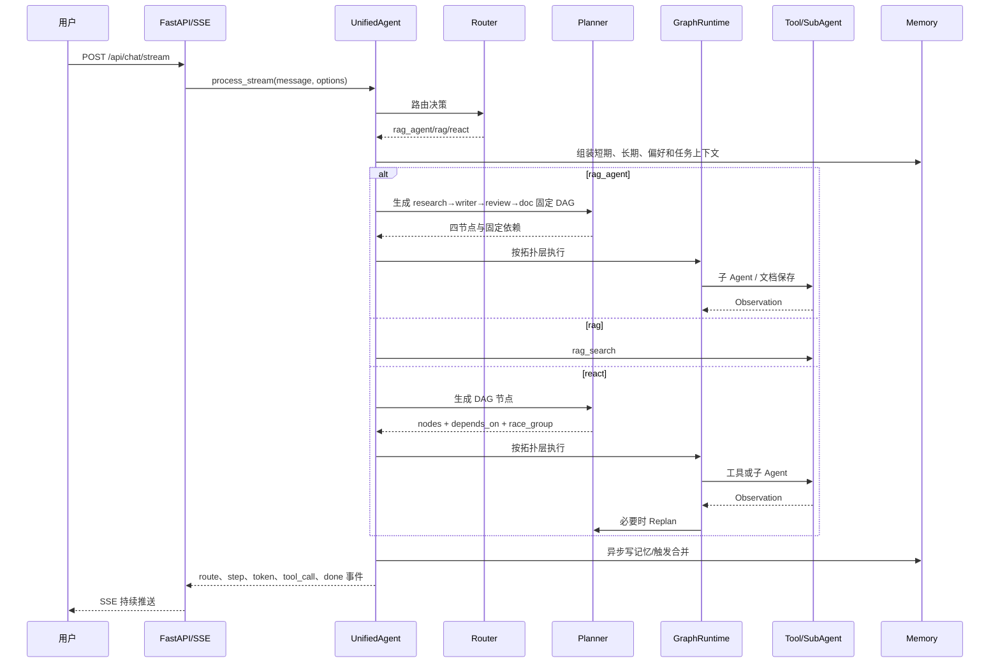

# 腾讯面试：AGI-saber 全链路源码核验与深挖手册

> **当前架构说明（2026-09-14）**：Go `845e8f7` 的真实主链是 `rag_agent / rag / react` 三路，并内置 Research/Writer/Review/Doc 固定报告 DAG。Python 已按源码恢复同样的路由、角色、依赖与文档落库行为。

> 适用岗位：医疗 AI Agent 质量评测实习生  
> 学习依据：个人简历、语雀 AGI-saber 文档、当前 Python 源码与自动化测试  
> 首次核验日期：2026-08-30；当前能力基线更新于 2026-09-02

## 1. 先给项目一个准确定位

AGI-saber 不是一个只有聊天框的 RAG Demo，也不只是“上传文件后问问题”。它是一个面向个人知识与复杂任务的 Agent 系统，核心能力包括：

1. 根据请求选择 `rag_agent / rag / react`；普通对话与工具调用是 `react` 内部执行形态，报告型子 Agent 走固定 DAG；
2. 把复杂任务规划成带依赖关系的任务 DAG，按拓扑层并行执行；
3. 支持同类工具竞速、失败重试、取消、超时、动态 Replan 和执行 Trace；
4. 支持向量、BM25/关键词、知识图谱三路检索，经 RRF 融合和可选重排后生成答案；
5. 支持短期记忆、长期记忆、用户偏好、图记忆和任务内存；
6. 支持 research、writer、review、doc 四个子 Agent 协作生成并保存报告；
7. 内置 Agent 质量评测平台，覆盖意图、槽位、工具、RAG 证据、异常兜底、隐私与安全硬门禁。

面试时可以用一句话定位：

> AGI-saber 是一个基于 FastAPI 的个人知识与任务执行 Agent。我主要从 RAG 检索、任务图调度、记忆、Trace 和自动评测几个层面，把“能回答”扩展为“能规划、能调用工具、能执行、能观测、能评测和能降级”的完整链路。

注意：“完整链路”不等于生产级成熟系统。后面必须区分已经实现、默认启用、已有测试和仅有设计文档的能力。

## 2. 当前 Python 版的证据基线

本地采用以下命令核验：

```powershell
$env:PYTHONPATH=(Get-Location).Path
python -m pytest -q --basetemp <项目内临时目录>
```

结果必须保留同一提交、同一命令的原始输出；静态手册不固化会随用例增长而过期的通过数。这些测试能够证明当前代码在隔离测试环境中满足已有契约，但不能直接证明线上质量、RAG 指标或高并发性能。面试时要把“功能正确性”“检索质量”“系统性能”分开讲。

当前源码还能直接确认：

- `config/config.yaml` 中 RRF 常数 `k=60`；Milvus/ES 两路当前都用 `1.0` 权重，KG 读取 `kg_weight`；`semantic_weight=0.7` 仅保留为 Go 配置兼容字段；
- 动态 Replan 在 YAML 中启用，最大 2 次，节点失败可以触发重新规划；
- 重排能力有实现，但是否启用由配置决定；
- 当前 Alembic 迁移头为 `0016_verified_runtime_identity`，共 16 段；
- 自动化测试范围已在简历早期 122 项基线之后继续扩充；当前通过数以现场全量回归为准。

## 3. 整体架构



核心源码入口：

| 层次 | Python 文件 | 主要职责 |
|---|---|---|
| 启动 | `main.py` | 加载配置、基础设施、Agent 与 FastAPI |
| API | `internal/handler/handler.py` | HTTP/SSE、上传、工具和文档等接口 |
| Agent | `internal/agent/agent.py` | 组装组件、路由分发、上下文、工具与图执行入口 |
| 路由 | `internal/agent/agent.py`、`internal/agent/planner.py` | `rag_agent/rag/react` 主分发与报告关键词判断 |
| 规划 | `internal/agent/planner.py` | LLM Planner、规则兜底、Replanner |
| 图结构 | `internal/graph/task_graph.py` | 节点、依赖、环检测、拓扑层 |
| 图执行 | `internal/agent/graph_runtime.py` | 分层并行、竞速、取消、重试、Replan、事件 |
| 工具 | `internal/tools/tools.py` | 工具描述、执行与 MCP 接入 |
| 子 Agent | `internal/agent/subagents.py` | research/writer/review/doc 协作 |
| RAG | `internal/rag/hybrid.py` | 三路召回、RRF、父段落回填和降级 |
| 重排 | `internal/rag/reranker.py` | LLM listwise 重排与解析失败回退 |
| 记忆 | `internal/memory/` | 短期、长期、偏好、图记忆与合并 |
| 上下文 | `internal/promptctx/` | 不同模式的上下文槽位、预算与组装 |
| 评测 | `internal/evaluation/` | 数据集、执行、指标、Badcase、报告、门禁 |

## 4. 一条请求到底怎么跑



### 为什么用 SSE，不直接等 HTTP 返回？

- Agent 任务可能包含规划、多个工具、检索、写报告，延迟较长；
- 普通 HTTP 一次性返回时，用户看不到中间状态，也难取消；
- SSE 适合服务器到浏览器的单向事件流，比 WebSocket 更轻量；
- WebSocket 更适合高频双向交互，而这里主要是服务端持续推送进度和 token。

代价：SSE 仍需处理心跳、断线、事件编号、幂等、任务取消和代理层超时。

## 5. 为什么不是所有问题都走 ReAct

如果每个请求都先让 Planner 规划：

- 增加一次甚至多次 LLM 调用，延迟和费用上升；
- 简单问题被过度复杂化；
- Planner 输出不稳定会增加新的失败点；
- 工具越多，错误选择和错误参数概率越高。

因此项目先做三路主分发：

- `rag_agent`：开启且已加载知识库，并命中研究/调研/总结/报告/文档/方案/分析关键词；
- `rag`：开启且已加载知识库，但未命中报告关键词；
- `react`：其余请求，内部再决定直接回答或调用工具，且不启用报告子 Agent。

代码中仍有 `chat/tool` Schema 和辅助判断，但它们不是当前顶层模式。报告路由是与 Go `845e8f7` 对齐的宽关键词规则，不要求显式保存意图。

这是“按复杂度付费”的设计：简单请求走短链路，复杂请求才启用图调度。

## 6. Plan-and-ReAct 与任务 DAG

### 6.1 为什么不用纯串行 ReAct

传统串行 ReAct 是：Thought → Action → Observation → 下一步。优点是灵活，缺点是：

- 彼此独立的工具也被串行执行；
- 每一步都可能再次调用 LLM；
- 中间状态不易持久化；
- 长任务恢复、取消和进度展示困难。

任务 DAG 把节点依赖显式化：无依赖节点可以并行，有依赖节点按拓扑顺序执行。`TaskGraph` 负责结构正确性，`GraphRuntime` 负责运行时。

### 6.2 为什么还要动态 Replan

静态 DAG 假设最初规划完全正确，但工具返回结果可能改变后续计划。动态 Replan 在层执行结束或节点失败后，把当前图、观察结果和失败原因交给 Replanner，追加新的节点。

优点：适应真实观察结果。代价：

- 可能无限循环，因此配置最大 2 次；
- 新节点仍要做 ID、依赖、环和工具白名单校验；
- Replan 本身增加延迟和不可确定性。

### 6.3 竞速组为什么存在

相同目标可能由多个信息源完成，例如网页搜索和知识库检索。把它们放入同一 `race_group` 后并行执行，首个成功结果获胜，其余请求取消。

适合：语义等价、任一路成功即可的工具。  
不适合：多个结果必须汇总，或不同数据源有不可替代证据的任务。

面试官若问“竞速一定更快吗”，正确回答是：不一定。它用额外资源换尾延迟，只有工具结果等价、延迟波动较大、取消真的能生效时才值得。

## 7. 工具调用与 Harness

工具调用不是让模型直接执行任意代码，而是：

1. 工具注册时声明名称、描述和参数；
2. Router/Planner 只能从允许列表选择；
3. 参数经过解析、偏好补全和校验；
4. Runtime 设置超时、重试和取消；
5. 结果成为 Observation，并写入 Trace；
6. 最终生成器基于观察结果回答。

Harness 的核心不是某个类名，而是把不稳定的模型决策包在确定性的工程约束中：白名单、Schema、超时、重试、软失败、快照、事件、幂等和降级。

MCP 工具优先返回结构化 `ToolResult`，保留 payload、原始 JSON、错误码、耗时和 `retryable`。参数错误、HTTP 4xx 与主动取消不重试；网络错误、超时与 HTTP 5xx 才能在上限内重试。取消会停止等待与后续尝试，但已经进入同步工作线程的底层调用无法保证被硬杀；有副作用的远程工具仍需服务端幂等键。

替代方案：直接依赖模型原生 Function Calling。原生调用协议更规范、解析更轻，但会绑定模型服务；项目采用自己的工具抽象，可以统一本地工具、MCP、知识库与子 Agent。代价是自己承担解析与校验复杂度。

## 8. 四个子 Agent 如何生成报告

报告流程不是模型声称“无法访问本地文件系统”，而是明确走工具与子 Agent：

```text
research_agent
    ↓ 提取证据和开放问题
writer_agent
    ↓ 生成 Markdown 初稿
review_agent
    ↓ 检查可信度、缺证据与问题
doc_agent
    ↓ 调用真实 document repository 保存，可选择再入 RAG
```

四个角色拆分的好处：职责和中间产物可观测，失败可以定位到研究、写作、审查或保存。代价是调用次数、延迟和成本增加。当前宽关键词规则会让“简单总结”也可能进入完整流水线，这是已知风险；Review 只保留意见和元数据，Doc 仍保存 Writer 草稿，没有 Revision 或 Final Gate。

对应源码：

- `internal/agent/planner.py::subagent_pipeline_nodes`
- `internal/agent/subagents.py`
- `internal/agent/agent.py::_write_document_tool`

## 9. RAG：为什么是三路召回

### 9.1 三种信号的分工

| 路径 | 擅长 | 典型弱点 |
|---|---|---|
| 向量 | 同义表达、语义相似 | 编号、专名和精确字符串可能漏召回 |
| BM25/关键词 | 专名、错误码、编号、原词匹配 | 无法很好理解同义改写 |
| 知识图谱 | 实体关系、多跳和结构化关联 | 构建和维护成本高，实体抽取可能出错 |

图谱不是“问题复杂就启用”，而应由关系型意图或实体识别结果触发。三路互补后再融合。

### 9.2 为什么用 RRF，不直接相加

向量相似度、BM25 和图检索分数量纲不同，直接相加需要可靠校准。RRF 只依赖各路排名：

```text
score(d) = Σ weight_i / (k + rank_i(d))
```

优点：对分数量纲不敏感，多路同时命中的文档自然加分。  
缺点：丢失原始分数强弱信息，仍需验证集调权重，某一路没召回的文档无法被融合补救。

当前代码证据：`internal/rag/hybrid.py` 中 `k=60`，Milvus 与 Elasticsearch 各使用 `1.0`，知识图谱使用 `kg_weight`；`semantic_weight=0.7` 只为配置结构兼容保留，不参与当前 RRF 计分。

### 9.3 为什么有 RRF 还要重排

RRF 是快速粗排，只利用排名；重排把 Query 与候选段落一起判断，计算更贵但精度更高。因此先扩大召回候选，再对小集合精排。

RRF 主要保召回，Rerank 主要改善前排排序。重排不新增候选，因此 NDCG/MRR 可能提升，而 Recall 基本不变，这是正常现象。

### 9.4 小块召回、父段落补全

大段落常包含多个主题，向量语义被稀释；小块主题集中，更容易准确命中。但只把小块交给模型又可能缺上下文。

所以入库时保存 `child content + parent_content`，查询时对子块建立索引，命中后回填父段落，并在 Token 预算内去重。

当前 Python 版的父子关系是子块记录中保存 `parent_content`，不是严格规范化的 `parent_id` 表。当前去重以内容为主，不能把简历中的“0.85 父段落相似度去重”当作当前代码事实。

### 9.5 降级链路

远程向量、关键词或图服务不可用时，可退化到本地存储和词法检索。降级能保可用性，但会损失：

- 大规模近似向量搜索能力；
- Elasticsearch 的成熟 BM25、过滤与扩展能力；
- Neo4j 多跳关系检索；
- 分布式容量和吞吐。

验证降级不能只看 HTTP 200，还要验证结果相关性、无答案行为、延迟、Trace 中的降级标识和恢复后的回切。

## 10. 记忆系统不是“把聊天记录都存起来”

### 10.1 五类记忆

| 类型 | 生命周期 | 作用 |
|---|---|---|
| ShortTerm | 当前会话最近若干轮 | 保持多轮连续性 |
| Preference | 跨会话、按用户 | 城市、语言、格式等稳定偏好 |
| LongTerm | 跨会话 | 有价值的事实、事件和经验 |
| GraphMemory | 跨会话、关系化 | 用实体关系扩展召回和保护重要节点 |
| TaskMemBuffer | 单次任务 | 保存工具观察与中间结果，避免污染用户长期记忆 |

### 10.2 长期记忆与偏好的区别

- “我常住深圳、回答用中文”是可复用配置，适合 Preference；
- “我下周参加腾讯面试”是带时间和事件性质的信息，适合 LongTerm；
- “search_web 返回了三个网页”只服务当前任务，适合 Task Memory。

如果不区分：工具临时结果会污染长期画像，陈旧事件会被当成固定偏好，Prompt 越来越长。

### 10.3 召回与合并

长期记忆召回综合语义相似度和重要性。当前代码注释中的核心形式为：

```text
score = similarity * 0.7 + importance * 0.3
```

记忆合并包含去重、相似记忆合并、TTL/衰减与图中心度保护。图中心度保护的含义是：即使某条记忆表面上旧，如果它与很多重要记忆有关，也不应轻易删除。

### 10.4 多库一致性

SQLite 与 PostgreSQL 长期记忆仓储都在同一事务提交权威行和 Outbox。SQLite Worker 更新本地投影账本；PostgreSQL 的 Outbox 按 Milvus/Neo4j target 拆分，生产消费者实现租约领取、指数退避、dead-letter 和周期 reconcile。投影按单调版本和内容哈希处理重复、旧序与冲突，且数据库提交成功后才更新进程缓存。读取仍以权威库为准，外部向量库/图谱是可重建的最终一致投影。

不要把“所有库强一致”或“生产恢复已经验证”说出口。跨 PostgreSQL、向量库和 Neo4j 做分布式强事务代价很高；当前自动化验证覆盖合同与本地适配器，真实 Milvus/Neo4j 的断线、乱序、重复投递和并发消费者仍需完整环境故障注入。

## 11. Agent 评测平台：与腾讯 JD 最匹配的模块

当前 Python 版 `internal/evaluation/` 不只评测最终答案，还能围绕 Agent 链路评测：

- 意图识别准确性；
- 必填槽位召回；
- 工具选择 F1；
- 工具参数准确性；
- RAG 证据 F1 与必需内容召回；
- 异常兜底恢复；
- Trace 完整性；
- 隐私不泄漏；
- 诊疗边界与内容安全；
- P50/P95 延迟、通过率、Badcase 和 Prometheus 指标。

其中隐私与安全支持硬门禁。医疗场景不能只看总体平均分：一条 S0 隐私泄漏或致命医疗安全错误，就不能被大量普通问题的高分稀释。

### Trace 排障模板

以“用户说青霉素过敏，Agent 却推荐阿莫西林”为例：

1. 原始输入是否完整；
2. 意图和实体抽取是否识别过敏信息；
3. 短期记忆和 Prompt 上下文是否带入；
4. RAG 是否召回禁忌证据；
5. 工具参数是否包含过敏史，返回是否正确；
6. 最终模型输入是否仍有该信息；
7. 模型是否无视信息生成错误建议；
8. 安全规则和输出拦截为何没挡住。

核心不是一开始猜“检索坏了”，而是找到关键信息第一次丢失的位置。

## 12. 简历与语雀说法的证据等级

### 12.1 可以直接讲，并能指到代码

- FastAPI 后端与 SSE 流式事件；
- `rag_agent/rag/react` 三路主分发；
- Planner、TaskGraph、GraphRuntime；
- `depends_on`、拓扑层并行和 `race_group`；
- 动态 Replan，当前配置最大 2 次；
- 四个报告型子 Agent 与真实 `write_document`；
- 向量、关键词、图谱三路检索与 RRF；
- 小块索引、父段落内容回填；
- 短期、长期、偏好、图和任务记忆；
- Agent 评测、Badcase、Trace、安全硬门禁；
- 当前测试通过数以同一提交的全量回归输出为准。

### 12.2 可以讲，但必须注明是历史基线

- 早期资料快照曾记录 47 条路由、4 个迁移、122 项测试、9 组 E2E；这些不是当前口径，当前代码已经继续演进；
- 如果简历不改，回答时要说“这是我当时完成重构阶段冻结的基线，当前仓库又新增了评测等模块”。

### 12.3 暂时不能当作已验证事实

- RRF 0.65/0.35：这不是 Go `845e8f7` 的实际计分行为，不能当成已验证事实；当前对齐口径是 Milvus/ES 均为 1.0，KG 单独加权；
- 父段落 0.85 相似度去重：当前 RAG 回填代码不能证明这个实现；
- “熔断已经过真实生产故障验证”：当前确有通用 Closed/Open/Half-Open 状态机并覆盖 Rerank、Embedding 与三路检索，但还缺真实外部依赖的故障注入、指标告警和容量验收；
- 无答案阈值 0.30 已校准：需要验证集、校准脚本和运行结果；
- NDCG@10=0.83 与具体 RAGAS 数字：仓库有 1250 篇文档生成脚本、10000 chunks 和 50 Golden Queries，但没有找到可复现这些最终指标的评测脚本与结果文件。

面试原则：没有实验记录就说“方案与待验证项”，不要说“已经提升了多少”。

## 13. 技术选型高频追问

### FastAPI vs Flask/Django

- FastAPI：类型模型、OpenAPI、异步接口和 SSE 生态适合 AI 服务；
- Flask：更轻，但校验、Schema 和大型工程约束需要自己补；
- Django：ORM、管理后台完整，但对本项目的 Agent 流式服务偏重。

### 自研 GraphRuntime vs LangGraph

- 自研：执行语义、Trace、竞速与降级完全可控，面试时也能解释内部原理；
- LangGraph：状态图、持久化和生态更成熟，开发效率更高；
- 代价：自研需要自己处理恢复、并发安全、观测与兼容，不能因为“可控”就忽略维护成本。

### Milvus vs FAISS/pgvector

- Milvus：面向大规模向量检索，索引和分布式能力更完整；
- FAISS：本地库、简单快速，但持久化、多租户、过滤与服务治理要自建；
- pgvector：与 PostgreSQL 事务和过滤结合好，规模较小时运维简单；
- 选型应由数据规模、过滤需求、可用性和团队运维能力决定，不是模型越多越好。

### Neo4j 是否必要

如果知识主要是独立段落，向量+关键词通常足够；只有实体关系、多跳查询和图结构本身具有业务价值时，Neo4j 才值得引入。知识图谱会增加抽取错误、同步一致性和运维成本，因此应由离线评测证明增益。

## 14. 语音学习的固定方式

每个模块按以下方式进行，不让你死背：

1. 我先用业务例子讲清楚问题；
2. 再解释为什么选当前方案，以及不用它会怎样；
3. 对比同类方案与代价；
4. 指到 Python 源码和配置；
5. 我给一道腾讯式追问；
6. 你用自己的话回答；
7. 我评分、指出漏洞并给出可上场版本；
8. 最后换一个 Badcase 检查你是否真正理解。

第一讲从“一条请求如何被路由并执行”开始，再进入 Planner 与任务 DAG。RAG 已经学过的部分只做快速复习，重点补齐工具调用、动态 Replan、竞速、记忆、Harness、子 Agent、Trace 和评测平台。

## 15. 第一讲课前必须记住的三个边界

1. Router 决定走哪条执行链；Planner 只负责复杂任务如何拆，不是所有问题都调用；
2. TaskGraph 描述依赖，GraphRuntime 执行并负责并发、竞速、重试、取消和 Replan；
3. LLM 做不确定的理解与规划，Harness 用确定性规则约束它的输出和执行。

如果能用自己的语言解释这三个边界，就真正跨过了“只会讲 RAG”的阶段。
